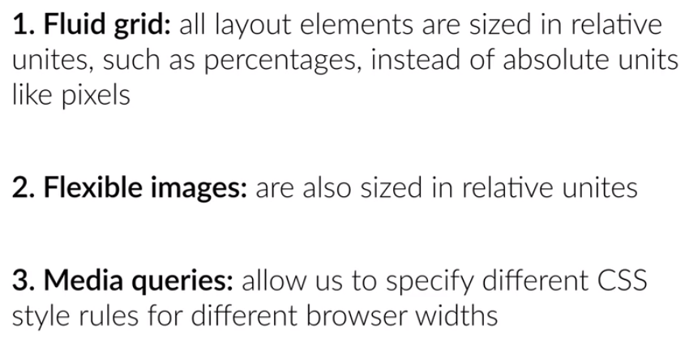

### HTML CSS Project

#### 1. Basic
 `note : JS_L37 onwards`
1. Create project struture - resource, img, css,etc folders + **index.html** .
2. add `link` in index.html for normalized.css, app css(style.css), and google font.

> `<link href="https://fonts.googleapis.com/css?family=Lato" rel="stylesheet">`

***

#### 2. Intial styling
1. Clear browser defaults. 
```
* {
    margin: 0;
    padding: 0;
    box-sizing: border-box;
}
```

2. Set background-color and color for entire app 
```
body {
    background-color: #fff;
    color: #555;
    font-family: 'Lato', 'Arial', sans-serif;
    font-weight: 300;
    font-size: 20px;
    text-rendering: optimizeLegibility;
}
```

> text-rendering: optimizeLegibility --> this  will help in perfect rendering.

> font-weight: 300 --> 

***

#### 3. Responsive WEB design - theory

1. it means it should work in any device of any resolution, without zoom-in and out.
2. it should get changed automatically as per browser size.
3. 50 % of moble traffic is of Mobile users, as per google; Increase in future. hence emracing mobile friendly design.
4. Three ingredient for responsive website:



5. go : http://www.responsivegridsystem.com/ 
and generate css file. everything is already compiled in sinle file - `./vendor/css/grid.css`
Note : Will Check later how grid works.

***

#### 4. Add Header - part-1
1. `<Header class="ui-tech-test-box">`
- Horizontally center container
- It may contain some heading elements but also other elements like a logo, a search form, an author name, and so on.

2. Add image in viewport, Blur image with black
```
header {
    background-image: linear-gradient(rgba(28, 25, 25, 0.85), rgba(28, 25, 25, 0.85)), url(img2/header-bg-2.jpg);
    background-position: center; background-size: cover;
    height: 100vh;  /* The vh unit can be used to fill the background of the viewport */
}
```

3. Set `<header>` in center:
```
.ui-tech-test-box {
    position: absolute;
    width: 1140px;
    top: 50%; left: 50%;
    transform: translate(-50%,-50%);  
}
```

outPut:


#### 5. Add Header - part-2

1. Improvement 1:
```
header {
...
color: #fff ; font-size: 200% ; /* 6.1 body:20px, hence 40px */
font-weight: 100;  /* 6.2 thickness */
text-transform: uppercase;
letter-spacing: 1px;
word-spacing: 20px;
}
```

2. buttons ans style:
```
template:

<a href="#" class="btn btn-lime"> Learn UI technologies</a>
<a href="#" class="btn btn-tan"> Show More</a>
 
Style:

.btn {
    display: inline-block; padding: 20px 40px;   font-weight: 300;
    text-decoration: none;
    border-radius: 50px;    
    color: #fff;
}

.btn-lime {
    color: #e74c3c; 
    border: 2px solid #e74c3c;
}

.btn-tan {
    background-color: #009688;
    border: 2px solid ##2ecc71;
}
```
outPut:


3. Add Button style on :
```
.btn-tan:link, 
.btn-tan:visited {
    color: #fff;
    background-color: #1abc9c;
    border: 2px solid #2ecc71;
}

.btn-tan:active,
.btn-tan:hover {
    color: #2d3317;
    background-color: #16a085;
    border: 2px solid #2d3317;
}
```
4. Add animation
```
.btn-tan:active,
.btn-tan:hover {
    color: #2d3317;
    background-color: #16a085;
    border: 2px solid #2d3317;
    transition: background-color 2.5s, border 2.5s, color 0.5s ;
}
```
5. Add logo and nav bar
```
template :

<nav>
            <div class="row">
                
                
                <ul class="main-nav">
                    <li><a href="#">About</a></li>
                    <li><a href="#">Sign up</a></li>
                    <li><a href="#">sign in</a></li>
                </ul>
            </div>
        </nav>
        
Style:

.main-nav {
    float: right;
    list-style: none; /**/
    margin-top: 55px;
}

.main-nav li {
    display: inline-block;  /**/
    margin-left: 40px;
}

.main-nav li a:link, .main-nav li a:visited {
    color: #fff;
    font-size: 70%;
    border-bottom: 3px solid transparent;
}

.main-nav li a:hover, .main-nav li a:active {
    color: #e74c3c;
    border: 1px solid #fff; 
    border-bottom: 3px solid #e74c3c;
    padding: 8px;
    transition: border-bottom 1.0s;
}

.logo {
    height: 100px;
    width: auto;
    float: left;
    margin-top: 20px;
}
```
outPut:
