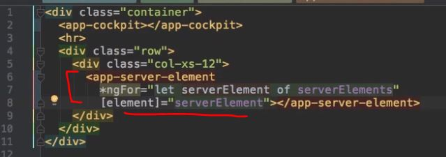
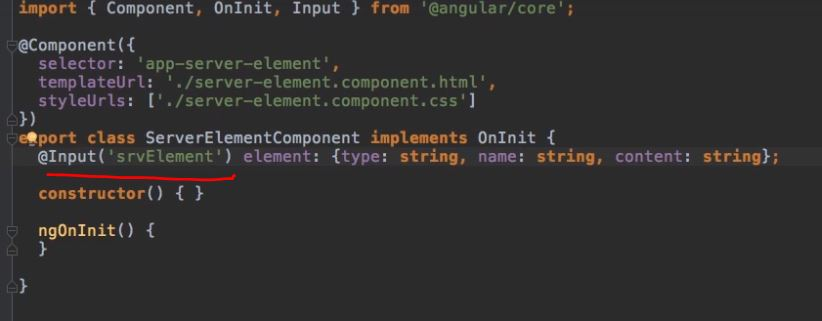

## Course Project Example (Comp comm.)
```
 - app comp 
   - server-element : to display list of servers
   - cockpit : to manipulate server
```


### Case 1: Parent => child
- app-comp (**parent**)
```js
  servers: any[]  = [
    {name:'s1', type:'real'},
    {name:'s2', type:'real'},
    {name:'s3', type:'blueprint'}
   ] 
```
- pass it down to child server-element(**child**) 





---
### Case 2: Child => Parent
- Change individual server at `cockpit comp`
- update servers[] at parent `app comp`


---
### Case 3: sibling1 => sibling2
- Services +  ngRX
  - define **common service** for sibling components .
  - comp1 > update data in srv1 > emit event1 of srv1. > using `EventEmitter` or `Subject` (will cover later)
  - comp2 > subscribed to event1 > will recieved updated data.


