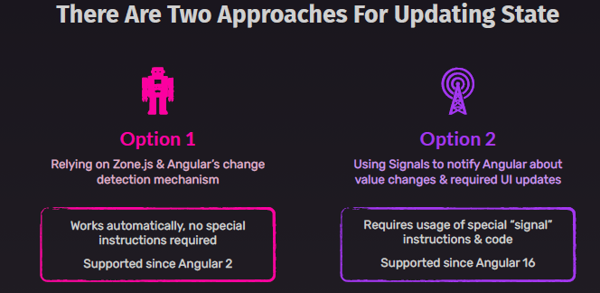
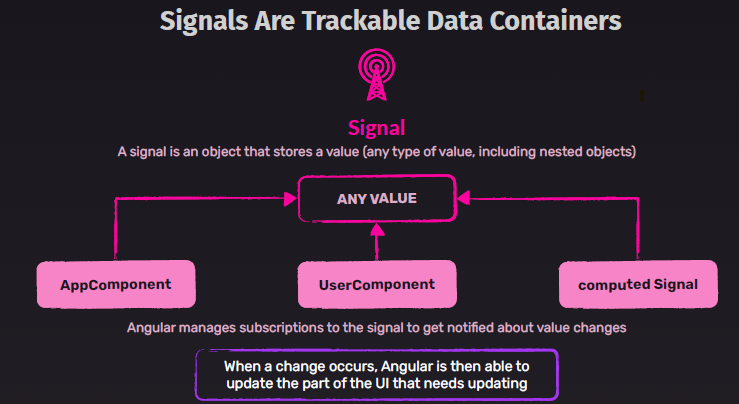

# ng16 : Signals
- stable in ng17

## A. intro
**option-1**  ( < ng16): `chnage dectection mechanism + zone.js`
- updating value of any property in any component
  - change is automatically detected
  - passed to template/view
  - note: zone.js notifies about user event, expired times, async task result, etc
  
**option-2**( > ng16) : `signal`
  - inspired from Rxjs and Ngrx, so should be easy to understand for me.
  - signal1 = signal({ k1:v1, k2:v2})
  - subscribe on : :point_left:
    - template: {{ **signal1()**.k1 }}
  - Deriving signal
    - signal2 = **computed**( () => **signal1()**.k1 )
  - **effect**( () => { ...signal1()...})
    - Effect, re-runs callback whenever any of those signals change.
    - check below example for more.
  - **Adv**:
    - perfomance enhanced.
    - so now component does not check **every possible event** for any update to receive.
    - if not using Subject, EventEmitter, then app is pure **zoneless**, And then can remove `zone.ts` from build. (future) :point_left: :point_left:






## B Key Features
- **Reactive Values**: Signals wrap values and notify consumers when those values change
- **Granular Change Detection**: 
  - More efficient than Zone.js-based change detection
  - Better performance: Reduces unnecessary change detection cycles
  - Only components that use changed signals update.
- **Computed Values**: **Derived state** that updates automatically when dependencies change
  - more like redux - this.store.select()

## C developer guide
### Example-1
```typescript
import { signal, computed, effect } from '@angular/core';

// Creating a signal
const count = signal(0);

// Computed signal (derived value)
const doubleCount = computed(() => count() * 2);

// Effect (side effect)
// re-runs that callback whenever any of those signals change.
effect(() => {
  console.log(`Count is: ${count()}, Double is: ${doubleCount()}`);
});

// Update signal value
count.set(5); // Triggers effect
count.update(c => c + 1); // Increments value
```
### Example-2
```typescript
import { Component, signal, computed } from '@angular/core';

@Component({
  selector: 'app-counter',
  template: `
    <p>Count: {{ count() }}</p>
    <p>Double: {{ doubleCount() }}</p>
    <button (click)="increment()">Increment</button>
  `
})
export class CounterComponent {
  count = signal(0);
  doubleCount = computed(() => this.count() * 2);

  increment() {
    this.count.update(c => c + 1);
  }
}
```
### Example-3
```typescript
const userId = signal(1);
const userData = signal<User | null>(null);

// Effect to fetch data when userId changes
effect(async () => {
  const id = userId();
  const response = await fetch(`/api/users/${id}`);
  userData.set(await response.json());
});
```

