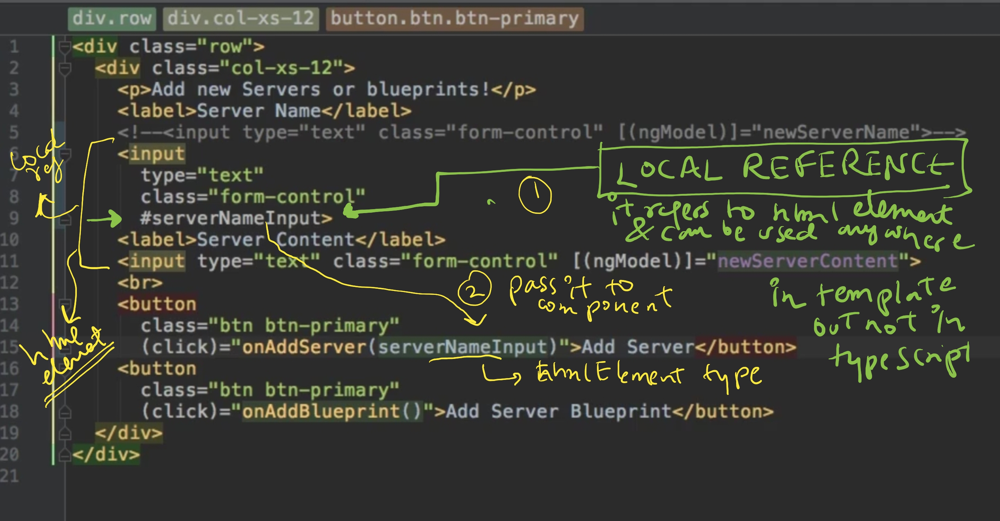
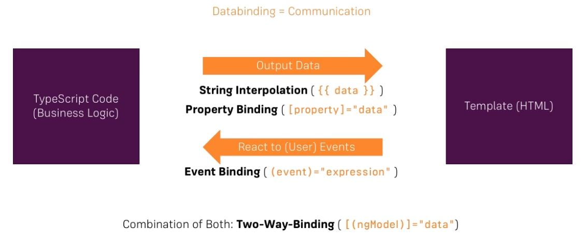
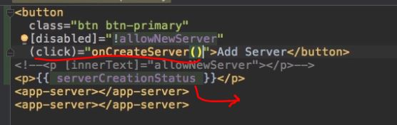

## A. Architecture
### 1. Change detection.
- https://chat.deepseek.com/a/chat/s/f3b93971-68b6-4204-b9c1-7380c3164ffd
  - changeDetection: ChangeDetectionStrategy.OnPush /Default
  - constructor(private cd: ChangeDetectorRef)
  - **TrackBy Function** | <div *ngFor="let item of items; trackBy: trackById">
---

## B. Developer
### 1. NgModules
- it provides context for components
- An Angular app is defined by a set of NgModules 
  - one **root module** (which provides the **bootstrap** mechanism that launches the application) 
  - many feature modules.
- **benefits**
  - **Organizing** complex applications into distinct functional modules 
    - helps in managing development, designing, re-usability, scalibity, etc
  - Also **lazy-loading** of module. :pont_left:
  - **import/export**
    - NgModules can **import** functionality from other NgModules
    - and allow their own functionality to be **exported** and used by other NgModules
- root module (bootstrap, special module)
- Could lazily load feature modules via ng routing
  - it will load registered comp + child comp
  
### 2. Components
```txt
@Component({
  selector: 'app-signin',
  templateUrl: './signin.component.html',
  styleUrls: ['./signin.component.css']
})

selector: 'app-signin'    |   <div app-signin> </div>
selector: '[app-signin]'  |   <div app-signin> </div>
selector: '.app-signin'   |   <div class="app-signin"> </div>
```
- **purpose**: moudule design, resuabilty, etc
- Each component defines:
#### 2.1 component TS
- **@Component class component-1** 
- has application data and logic
- constructor()
  - **@Injectable** service-1 : to load backend data
    - service-1
    - service-2
    - ...
    
#### 2.2 view
- HTML, that defines a view. has: 
  - html5-tags
  - ng-component-selector
  - ng-directive-selector
  - ng-pipe
  - ...
- inline: `template` or  external: `templateUrl`
- **Template Expressions** --> The text inside {{ }} 
- **Template Statement** --> (event) = statement
  

  
#### 2.3 styling
- `styleUrls` , `styles`
- many css/scss files
- npm install bootstrap@3y
  - go tp angular.json > add : "style": [ "node_module/bootstrap/dist/css/bootstrap.min.css" **, "src/styles.css"]
  - **global styling** - ../src/styles.css
  
#### 2.4 more
- `providers` - optional, to inject Services to component and to its child component.
- `animation` - optional. [011_Animation.md](004_01_Animation)
- `selector` : custom tag for component
- `encapsulation` : 
  - **native** : same as Emulated, but won't work in older browser
  - **None** : 
    - ng will not unique property/attribute
    - hence parent component style will be applied.
  - **Emulated** :point_left: 
    - ng adds unique property in every element. eg : ng-content-ego-2
    - then later it is used by css property selector to apply style.

#### 2.5 Component Communication Scenarios
- check sample code: [100_project_1_Component_Comm.md](UdemyProject/100_project_1_Component_Comm.md)
- **scenario-1/2** :: parent->child | parent<-child comm
    - `parent-component-1`
      - `child-component-1` (EventEmitter-1, subject-1)
- **scenario-3** : sibling comp comm
  - `service-1` (EventEmitter-1, subject-1), inject to both comp:
  - `comp-1`
  - `comp-2`

> NEXT 
> - @ViewChild:       Accessing a specific element or component
> - @ViewChildren:    Accessing multiple elements/components of the same type
> - @ContentChild:    Accessing projected content (ng-content)
> - @ContentChildren: Accessing multiple projected components
> - https://chat.deepseek.com/a/chat/s/5f94f633-26f3-4d75-bbda-f085f8965e0f

#### 2.6 local-reference and @viewChild @viewChildren :point_left: :point_left:
- Inside view, Create references on any html-element / component. eg `#ref1`
- using local reference:
  - way-1 (old tricky):  pass js-object (eg: HTMLInputElement) while calling method.
  ```html
  <input> (change)=m1(ref1: HTMLInputElement) </input>
  ```
  - way-2 (use this, preferred ): **@viewChild / @viewChildren**  
    - life cycle hook :: **ngAfterViewInit() { }**
  ```html
  --- template / view ---
  <h1 #ref1 >Angular View Decorators Demo</h1> 
  <comp-1></comp-1>  
  
  <comp-2 [name]="'First Item'"  #ref2> </comp-2>
  <comp-2 [name]="'Second Item'" #ref3> </comp-2>
  
  --- comp TS --- 
  // Class Component-2 :: selector - comp-2  
  // Class Component-2 :: selector - comp-2
  
   @ViewChild('ref1') viewElement: ElementRef;  
   @ViewChild(Component-1) viewElement: Component-1;    // Class Component-1 :: selector - comp-1
  
   @ViewChildren('ref2, ref3') viewElements: QueryList<ElementRef>; 
   @ViewChildren('ref1, ref2, ref3') viewElements: QueryList<ElementRef>; 
   @ViewChildren(Component-2) viewElements: QueryList<Component-2>;
  
   === Life cycle ===
   ngAfterViewInit() {
    // refer these - viewElement + viewElements
   }
  ```
#### 2.7 content projection and @ContentChild  @ContentChildren :point_left: :point_left:
- **ng-content** directive
- life cycle hook :: **ngAfterContentInit() {}**
- understand by example
```javascript
 template (Component-2 :: selector - comp-2):
    <h3>Box Component</h3>
    <ng-content></ng-content>  << catch PROJECTED content here >>
    <div>Projected content ends here</div>
 
 Component-2 TS
    @ContentChild('ref1') projectedParagraph: ElementRef;
    @ContentChild('ref2') firstProjectedItem: Component-2;
    @ContentChildren(Component-1) projectedItems: QueryList<Component-1>;
    
    lifeCycle:
    ngAfterContentInit() { 
     //  projectedParagraph, firstProjectedItem, projectedItems
    }
 
 app-component (root module) html/view
  <comp-2>
    // project here with local reference - ref1, ref2
    // <comp-1> </comp-1>  //Component-1
  </comp-2>   
```

#### 2.8 LifeCycle :yellow_circle:
- https://angular.dev/guide/components/lifecycle
- https://chat.deepseek.com/a/chat/s/6cbd1509-8d5d-4564-93e2-5017ffe902b9
```text
Creation Phase:
Constructor → ngOnChanges → ngOnInit → ngDoCheck → [ ngAfterContentInit → ngAfterContentChecked ] → [ ngAfterViewInit → ngAfterViewChecked ]

Update Phase:
ngOnChanges →                          ngDoCheck →                        ngAfterContentChecked   →                     ngAfterViewChecked

Destruction Phase:
ngOnDestroy
```

| Hook                  | Timing | Purpose | Frequency | Notes |
|-----------------------|--------|---------|-----------|-------|
| **Constructor**       | Before any other lifecycle hook | Dependency injection, simple initializations | Once | Not technically a lifecycle hook |
| `ngOnChanges()`       | Before `ngOnInit()` and when input properties change | Respond to input changes | Before init and when inputs change | Receives `SimpleChanges` object |
| `ngOnInit()`          | After first `ngOnChanges()` | Component initialization | Once | Preferred place for complex initializations |
| `ngDoCheck()`         | During every change detection run | Custom change detection | Very frequent | Use carefully for performance |
| `ngAfterContentInit()` | After content projected | Respond to content projection | Once | After first `ngDoCheck()` |
| `ngAfterContentChecked()` | After projected content checked | Respond after content check | After every `ngDoCheck()` | Runs frequently |
| `ngAfterViewInit()`   | After component's view initialized | Access view children | Once | Safe to access child components |
| `ngAfterViewChecked()` | After view checked | Respond after view check | After every `ngAfterContentChecked()` | Runs frequently |
| `ngOnDestroy()`       | Before component destruction | Cleanup | Once | Unsubscribe, clear timers here |

- Best Practices

✅ **Do**:
- Use `ngOnInit` for initialization
- Clean up in `ngOnDestroy`
- Use `ngAfterViewInit` to access view children
- Be cautious with frequent hooks (`ngDoCheck`, `ngAfter*Checked`)

❌ **Don't**:
- Put complex logic in constructor
- Forget to unsubscribe from observables
- Modify views in change detection hooks (can cause errors)

---  
### 3. Directives
- [002_Basic_3_Directives.md](002_02_Directives)

---
### 4. Binding/s
- https://chat.deepseek.com/a/chat/s/6cbd1509-8d5d-4564-93e2-5017ffe902b9
- 
#### 4.1 String Interpolation - {{ }} 
```html
<p>{{ title }}</p>
<p>1 + 1 = {{ 1 + 1 }}</p>
<p>Hello, {{ getUserName() }}</p>
---
{{fn(msg)}}
Anything which get converted into string is ok.
---
<p> {{ var1 }} </p>  | <p [innerText]=var1 > </p>  // trick-1 : both are same
```

#### 4.2 Event binding (View >> Component)
- `$event` is reserved keyword to capture the event data.
- case-1: **html event binding** 
```html
<button (click)="onButtonClick()">Click me</button>
<input (keyup)="onKeyUp($event)">
```
  - **(< HTMLInputElement >e.target).value**
    - 

- case-2: **custom ng-event**   :point_left:
  - @output event-1: EventEmitter < string >
  - @output event-2: Subject < T > 
```html
<comp-1 (event-2)="onEvent2($event)"> 
```
    
#### 4.3 Property binding (Component >> View)
- attribute of html tag
- property of ng-comp/ng-directive :point_left:
- **examples**
```html
<html-tag-1 [attribute]="var-1" />
<comp1 [property-1]="'string-value'" >  ===  property="string-value"
<comp1 [ng-directive1]=value />
<comp1 [property-1]=value />
```
```html

<button [disabled]="isDisabled">Click me</button>
<div [class.active]="isActive"></div>
<div [style.color]="textColor"></div>
```
```html
--- view ---
<button [disabled]="'true'"> </button> //static
<button [disabled]="'false'"> </button> //static

<button [disabled]="newValue"> </button> //dynamic

 --- component ---
boolean newValue = true;
setTimeOut( () => newvalue != newvalue, 5000); //after 5 sec toggle.
```

#### 4.4 two-way data binding
```html
<input [(ngModel)]="userName">
<!-- Equivalent to: -->
<input [ngModel]="userName" (ngModelChange)="userName = $event">
//remember to import **FormsModule** in your app module for **ngModel**
```
- **custom-1**
  - create var var1
  - create m1(event){...}
  - in html : [attribute-1]=var1
  - in html : (click) = m1($event)
- **custom-2**
```html
@Input() value: any;
@Output() valueChange = new EventEmitter<any>();

<app-custom [(value)]="someValue"></app-custom>
```
#### 4.5 more on binding
```html

=== Attribute Binding ===
<button [attr.aria-label]="closeLabel">X</button>
<td [attr.colspan]="colSpan"></td>

=== Class Binding ===
<div [class.special]="isSpecial"></div>
<div [class]="classExpression"></div> <!-- replaces all classes -->

=== Style Binding ===
<button [style.color]="isSpecial ? 'red' : 'green'">Button</button>
<div [style.width.px]="widthValue"></div>

=== special binding ===

  === *ngFor (Structural directive) ===

  <ul>
    <li *ngFor="let item of items; let i = index">
      {{ i }} - {{ item.name }}
    </li>
  </ul>

  === *ngIf (Structural directive) ===

  <div *ngIf="showElement; else otherTemplate">
    Content to show when condition is true
  </div>
  <ng-template #otherTemplate>
    Alternative content
  </ng-template>

  === ngSwitch ===

  <div [ngSwitch]="value">
    <p *ngSwitchCase="'A'">Value is A</p>
    <p *ngSwitchCase="'B'">Value is B</p>
    <p *ngSwitchDefault>Value is something else</p>
  </div>
```

---
### 5. Pipes
[010_Pipes.md](002_05_Pipes)
- transforming values, eg; dates and currency
- Angular provides predefined pipes for common transformations,
- define custom pipes.

---
### 6. Services
- **Purpose** 
  - Act as end point to interact with backend/server
  - Components interaction.
- Class with decorator @Injectable() 
- **injection**
  - Declare services in **NgModule provider** section. 
    - registers service with NgModule
    - Add it in **export** section to make services avialable to other module.
    - module is loaded, loads  registered services along with it, **lazily**.
- **register**
  - Declare services in **Component provider** section.
    - it will inject the service into component
    - and its child comp.
    - so, if we define Service at app Module, it will avilable to all inner module of app, no import is required.
```txt
- ng g s Myservice1
- ng generate service Myservice1
```
---
### 7. Routes 
- **Router service**  helps in define navigation paths among Angular-views (template + Component)
- It maps URL-paths to Angular-views, instead of traditional JSP pages.
- Follows browser convention : URL in the address bar, Click links and browser's back &forward buttons.
- Apart from that we can navigate to new views when the user clicks a button or selects from a drop box.
- router can lazy-load the **module**
- router logs activity in the browser's history
- The router interprets a link URL according to your app's view **navigation rules and data state.** and shows or hides view hierarchies.

---
### 8. Forms
- Declarative
- Reactive

---
### 9. testing : 
- jasmine 
- Karma
___
### 10. lib
- **Rxjs** : Observables
  - Angular itself used it alot.
  - Alternative for promise.
  - new : `signal`
- **HttpClient**
  - New: `HttpClientModule` (added in ng6)
  - [009_HTTP_1.md](009_HTTP_1.md)
  - [009_HTTP_2.md](009_HTTP_2.md)
  - [009_HTTP_3_CP.md](009_HTTP_3_CP.md)
  - [009_HTTP_CLIENT_1.md](006_httpClientModule)
  - [009_HTTP_CLIENT_2.md](009_HTTP_CLIENT_2.md)
- **NgRx** 
  - State management in Angular
  - [012_NgRX_1.md](007_NgRX_redux)
  - [012_NgRX_2_PRG-1.md](UdemyProject/100_Project_4_NgRx-1.md)
  - [012_NgRX_2_PRG-2.md](UdemyProject/100_Project_4_NgRx-2.md)


