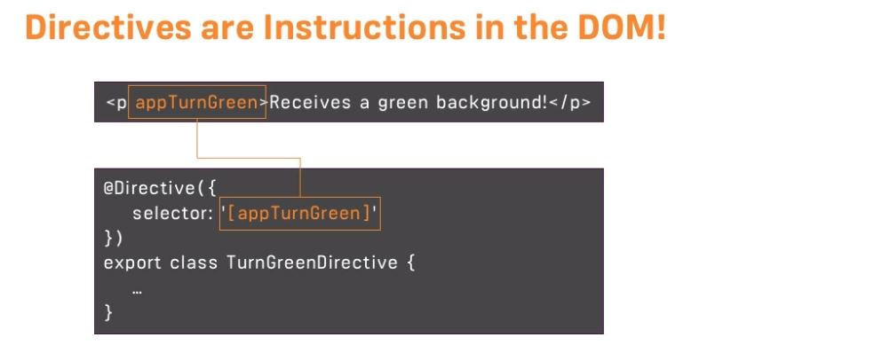
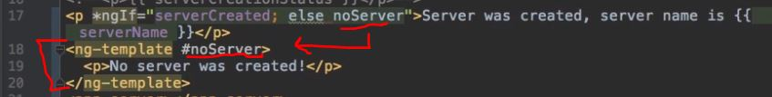
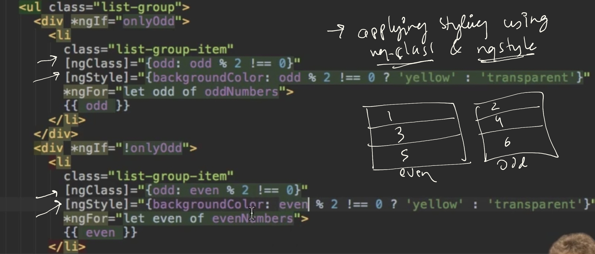

# Directives
- **ng generate directive directive-1**
- https://chat.deepseek.com/a/chat/s/1a0c68ef-97ed-40c6-8c2d-44361db77f1b
- code example: https://github.com/lekhrajdinkar/01-front-end-pack/tree/master/ng12/src/app/directives
---
## 1 Intro

- Directives are classes that add additional **behavior** to elements in your Angular applications
- like ng component, but  **without view**
- helps in manipulate the DOM, modify element appearance, or change behavior.
- **selector**: attribute style
- host element
- creates reusable behaviors and extend HTML's capabilities.

## 2 Types
### 2.1 structural directive
- which add/remove host elment from DOM
- cant apply 2 structural direective on same element. eg: display odd number:
- starts with *  
- * has special meaning and it get replaced with actual code. eg:
```html
< comp1 *ngIf="var1"> </comp1>`

--replacement code ---
 <ng-template [ngIf]="var1"> 
   <div>
     <comp1> </comp>
   </div>
 </ng-template>
```
#### 2.1.1 `*ngIf`
```html
  <div *ngIf="showElement; else otherTemplate">
    Content to show when condition is true
  </div>
  <ng-template #otherTemplate>
    Alternative content
  </ng-template>
```
- note: `<ng-template>  </ng-template>` is also directive. :point_left:
- otherTemplate - local reference
- 
- Another tricky way : use ngIf twice with reverse conditions :)

#### 2.1.2 `*ngFor` 
```html
 <ul>
  <li *ngFor="let item of items; let i = index">
    {{ i }} - {{ item.name }}
  </li>
</ul>
```
#### 2.1.3 `*ngCase` +  `[ngSwitch]`
```html
  <div [ngSwitch]="value">
    <p *ngSwitchCase="'A'">Value is A</p>
    <p *ngSwitchCase="'B'">Value is B</p>
    <p *ngSwitchDefault>Value is something else</p>
  </div>
```
#### 2.1.4 Custom Structural directive :yellow_circle:
- inject  `TemplateRef<any>` + `ViewContainerRef`
- this.viewContainer.**createEmbeddedView**(this.templateRef);
- this.viewContainer.**clear**();
- can skip it for now.
```typescript
@Directive({
  selector: '[appRepeat]'
})
export class RepeatDirective {
  constructor(
    private templateRef: TemplateRef<any>,
    private viewContainer: ViewContainerRef
  ) {}

  @Input() set appRepeat(times: number) {
    this.viewContainer.clear();
    for (let i = 0; i < times; i++) {
      this.viewContainer.createEmbeddedView(this.templateRef, {
        $implicit: i,
        index: i
      });
    }
  }
}
---
<ng-template appRepeat [times]="5" let-i="index">
  <p>Item {{i + 1}}</p>
</ng-template>
```

---
### 2.2 Attribute directives
- think of creating custom attribute.
- apply on host element (componet, other-directive, etc)
- Do **property binding** to assign dynamic value
  - < comp-1 [directive-1]="var1" > < / comp-1 >

#### 2.2.1 `ngStyle`  : dynamic styling
```html
obj1 =  { backgroundColor: red}      // camelCase format
obj2 =  {`background-color`: blue}   // css format

=== static ===
<p [ngStyle]="obj1"> {{status}}</p>
<p [ngStyle]="obj2"> {{status}}</p>

=== dynamic ===
<p [ngStyle]="{ backgroundColor: getColour() }"> {{ status }}</p>
getColour = () =>  this.status == 'online' ? 'green' : 'red';  // in TS file
```

#### 2.2.2 `ngClass` : add/remove classes dynamically
```html
obj1 =  { `class-1`: true}
obj2 =  { `class-1`: false}

=== static ===
<p [ngClass]="obj1"> {{status}}</p>
<p [ngClass]="obj2"> {{status}}</p>

=== dynamic ===
<p [ngClass]="{ `class-1`: addOrNot()}"> {{ status }}</p>
addOrNot = () =>  this.status == 'online' ? true : false ;  
```
#### 2.2.3 `ngModel` : two-way data binding

#### 2.2.4 Custom Attribute directive :yellow_circle:
- inject ElementRef (host element)
- inject **Renderer2**
  - this.renderer.**set/removeStyle**(element, 'property', 'value');
  - this.renderer.**add/removeClass**(element, 'className');
  - this.renderer.**set/reomveAttribute**(element, 'attrName', 'value');
  - const div = this.renderer.**createElement**('div');
  - this.renderer.**append/removeChild**(parentElement, childElement);
  - const unsubscribe = this.renderer.**listen**(element, 'eventName', (event) => {} ); unsubscribe();
  - secure against XSS attacks / Angular-recommended approach
- Passing 2 argumnet as well - String and MyInput
  - @Input() appBorder +  selector: '[appBorder]' : matching name/s :point_left:

```typescript
interface MyInput {  appBorder: string;  borderWidth?: string; }

@Directive({  selector: '[appBorder]'  })
export class BorderDirective 
{
  @Input() appBorder: string;
  @Input() borderWidth: string = '1px';
  
  @Input() appBorder: MyInput;  // <<<
  // @Input() set allInputs(myInput: MyInput) { }  // must have one arg only/-

  constructor(private el: ElementRef, private renderer: Renderer2) {
    //way-1
    el.nativeElement.style.border = `${this.borderWidth} solid ${this.appBorder}`;
    
    //Way-2 : Use Renderer2
    renderer.setStyle(el.nativeElement, 'background-color', 'red')   
    renderer.setStyle(el.nativeElement, 'border', `${this.borderWidth} solid ${this.appBorder}`) 
  }
}

---
<div [appBorder]="'red'" [borderWidth]="'2px'"> Content </div>
 - appBorder: directive itself.
    - appBorder: 1st arg
    - borderWidth: 2nd arg

<div [appBorder]="{appBorder: "red", borderWidth: "2px"} > Content </div>
```
---

## 3. Life Cycle
```typescript
@Directive({...})
export class MyDirective implements OnInit, OnDestroy {
  ngOnInit() {    // Initialization logic  }
  ngOnDestroy() {    // Cleanup logic  }
}
```
---

## 4. @HostListener / @HostBinding :point_left:
- `@HostListener` - Listens to host element events.
- `@HostBinding` - Binds to host element properties.
  - @HostBinding( `any property of host Element' )

```typescript

@Directive({  selector: '[appHover]' })
export class HoverDirective 
{
  @HostBinding('class.hovered') isHovered = false;

  @HostListener('mouseenter') onMouseEnter() {
    this.isHovered = true;
  }

  @HostListener('mouseleave') onMouseLeave() {
    this.isHovered = false;
  }
  
  constructor(private el: ElementRef, private renderer: Renderer2) { }
}
```
---
## 5. more inbuild directive
### 5.1 directive : `ng-template` 
- usecase-1 : used in structural directive
- usecase-2 ; *ngIf else template
- usecase-3 : create reusable template fragments

---
### 5.2 directive : `ng-content` 
- projection mechanism
- that lets you pass content from a parent component to a child component.
```html
<!-- Parent Component -->
<app-child>
  <p p1>This content will be projected 1 </p>
  <p p1>This content will be projected 2 </p>
  <p p2>This content will be projected 3 </p>
</app-child>
```
```html
<!-- Child Component --> 
// use @ContentChild on TS side to access projected content.
<div class="child-container">
  <ng-content select="[p1]"></ng-content> 
  <ng-content select="[p2]"></ng-content>
</div>
```
### 5.3 directive : `Router-Outlet`
- component style directive
```html
<Router-Outlet></Router-Outlet>
```
- acts as a **placeholder** 
  - that marks the spot in the view/tempate
  - where the router service should display the **mapped components**.
  
### 5.4  ng-container
- A logical container that doesn't render in the DOM
```html
<ng-container *ngIf="condition">
  <div>Content</div>
</ng-container>
```
---
## 6. program example/s
### example-1
- even/odd number list with different styling - ngClass and ngStyle.




