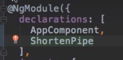

- https://chat.deepseek.com/a/chat/s/76c604d6-8ca8-4bd6-8f38-c080c9608956
--- 
# Angular Pipes
## 1. Intro
- transforms the data (**sync/Async**)
- clean way to handle data transformations **directly in your templates** :point_left:
- Use it at template/view, like directive.
- **ng g p pipe1**
- **{{ var1 | pipe1 : 'pipe-arg-1' : 'pipe-arg-2' : ... | pipe2  }}**
  - takes input as well
  - can be **chained**, order is matter
- **types**
  - **Pure pipes** (default) are only re-evaluated when the input value changes
  - **Impure pipes** are re-evaluated on every change detection cycle

## 2 Examples
### 2.1 built-in 
- https://angular.dev/api?query=pipe&type=pipe
```html
{{ 'hello' | uppercase }}  <!-- outputs 'HELLO' -->
{{ 'HELLO' | lowercase }}  <!-- outputs 'hello' -->
{{ 'hello world' | titlecase }}  <!-- outputs 'Hello World' -->

{{ today | date:'fullDate' }}  <!-- outputs 'Monday, June 9, 2025' -->
{{ today | date:'shortTime' }}  <!-- outputs '12:00 AM' -->
{{ today | date:'medium' }}     <!-- outputs 'Jun 9, 2025, 12:00:00 AM' -->

{{ 3.14159265 | number:'1.2-2' }}  <!-- outputs '3.14' -->
{{ 0.123 | percent }}  <!-- outputs '12%' -->

{{ 1234.56 | currency:'USD' }}  <!-- outputs '$1,234.56' -->

{{ {name: 'John'} | json }}  <!-- outputs '{ "name": "John" }'  object to JSON string--> 

{{ 'hello world' | slice:0:5 }}  <!-- outputs 'hello'  -->

{{ data$ | async }} <!-- Automatically subscribes to Observables/Promises -->

```
---

### 2.2 Custom
- Can be chained with inbuilt pipes as well
- ng generate pipe my-custom-pipe
- override `transform(X): Y` from **PipeTransform**

```typescript
@Pipe({  name: 'reverse', pure: false })
export class ReversePipe implements PipeTransform 
{
  transform(value: string): string {
    return value.split('').reverse().join('');
  }
}
```

#### Shorten text if lenght is  ore than 10 char.
- before : 
  - 
- Add pipe in declaration : 
  - 
- Add Pipe class : 
  - 
- After applying : 
  - 
- Add arg in pipe.
  - 

