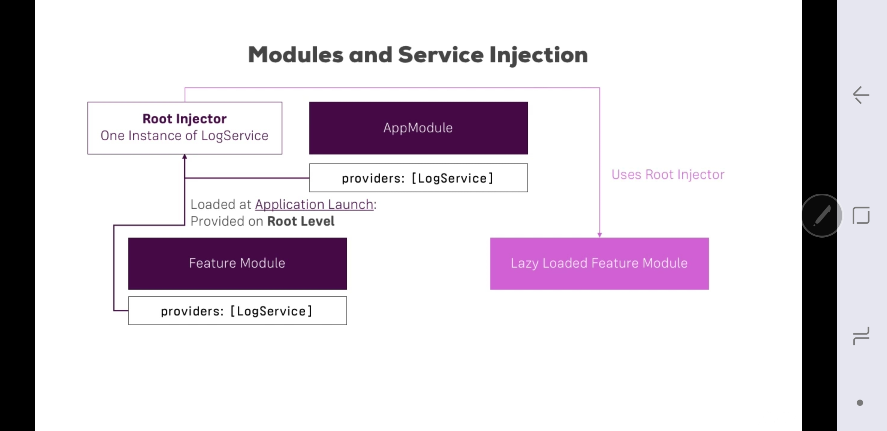

- skip(old,messy): [100_Project_3_NgModule.md](../../99_archive/99_ng_udemy_project_notes/100_Project_3_NgModule.md)
--- 
# NgModule
## 1 Intro
- provide greate enhancement from code restructuring perspective
- enhance performance - lazy Loading.
- Angular > **scans** for NgModule > all `component`,`directives`,`services`, etc are loaded then.
- A component/directive can be **declared only once** in any one Module.
- `Services` are created special space called root **injector**

---
## 2 Types:
### 1. root Module
- bootstrap app
- special module
- imports: BrowserMdule, commonModule (ngIf,ngFor,etc))
---
### 2. feature Module 
- eg:
  - feature module 
  - core Module 
  - shared module
  - routing module

- **load module**
  - eagerly : Create own Module and import it in root Module(bootstrap). This will eagerly load our module in project.
  - lazy : angular routing -  **loadChildren**

---
### 3. Shared Module
- **problem/scenario**
  - Component is created which is being used in module1 and module2
  - It has to be declared in both module
  - But declaration can be made only once in entire app.

- **Fix**:
  - Wrap component with shared Module
  - import shared mdule then in module 1 and module 2.

---

### 4. Core Module
- create import in root module (eager load), for:
  - Header component
  - footer component
  - Auth service
  - backdrop + spinne component
  - notification
  - Http service interceptor

---

### D. Service and Modules :yellow_circle:

#### 1. root Injector : 

#### 2. Child Injector : 

#### 3. Child Injector or root Injector ? 
Shared module is used in both eagerly loaded Module and lazily loaded Module.

In such scenarios, dont provide services in Shared module

