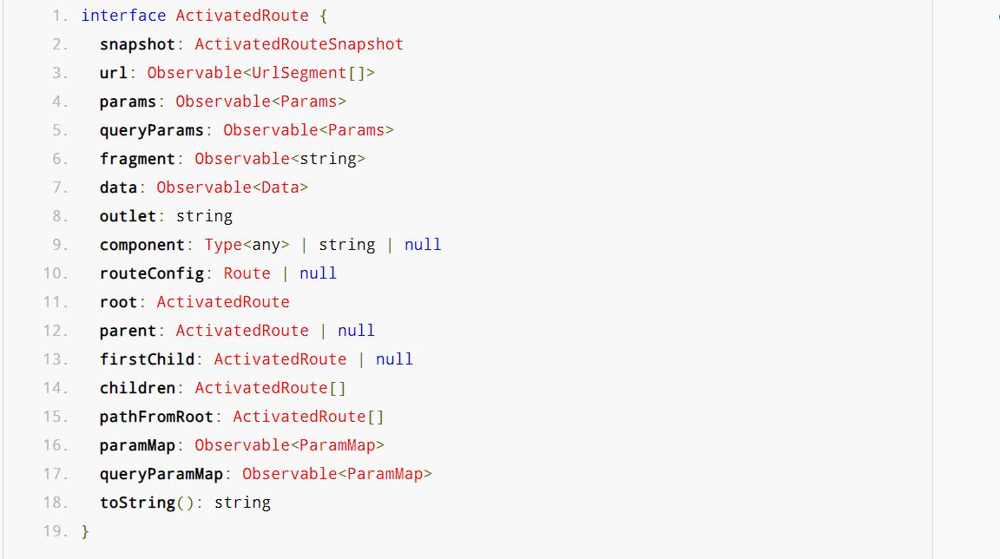

- https://chat.deepseek.com/a/chat/s/ad1409fe-ed2f-496b-9086-fa09fd88a585

--- 
## A. Intro : Routing
### 1. Browser - navigation model
- visit multiple **url** 
- navigate **links**
- everything's comes to **Browser History**
- back and forward buttons
- But, angular application is **SPA** and every time application **remains in same page**
  - how to write browser history? - sol: **RouterModule**

### 2. Ng RouterModule
- **npm i @angular/router**  (add explicitly)
- visit/navigate b/w views in ng-app
  - RouterModule, writes to browser-history about view/s navigation
- **routing rule**
  - **path1** --> module
    - path1/sub-path-1  ===> component-1
    - path1/sub-path-2  ===> component-2
    - ...
  - path2 --> ...
  - ...
- capability to **transfer data** while routing
  - path param, parameter, queryParam, fragment  
  - Fetch these **async** or **sync**.
- Navigation : 
  - **declarative** 
    - < a [routerLink]="['url1', 'p1','p2']" / > 
    - < a routerLink="url1"  [RouterActiveLink]="active" [RouterActiveLinkOption]="{exact:true}" / > 
    - if path is start with / then routerLink directive will take it absolute path, else relative
  - **programmatically** (Service/s : `Router` + `ActivatedRoute` )
    - srv.navigate(['url1','p1','p2'])
    - absolute/relative
    - singleton instance of srv
    - first-match wins strategy on `routesObj: Route[]` :point_left:
    - RouterModule.forRoot (routesObj, { **enableTracing**: true }) :point_left:
    - displays the mapped component on `Router-Outlet` directive on view.
      - placeholder for mapped component

### 3. more topics
- **Lazy loading** of module/component with routing. check below prg
- **routing Gaurd**
  - control navigation to and from routes
  - Types:
    - **CanActivate** - Controls access to a route
    - **CanActivateChild** - Controls access to child routes
    - **CanDeactivate** - Controls navigation away from a route
    - **CanLoad** - Controls lazy-loaded module loading
    - **Resolve** - Pre-fetch data before route activation
      - returns : Observable<T> | Promise<T> | T

- **routing event**  : https://angular.io/guide/router#router-events
  - pending...

- **ActivatedRoute** service
  - Router builds a **tree of ActivatedRoute objects** at the end each cycle.
  - Contains the information about a route associated with a component loaded in an outlet. 
  - hence will have all info for current path.
  - 

---
## B. Developer guide
### 1. Context:
```text
root-module , path /app

feature-module-1 , path /app/f1/*
  - component-11, path : /app/f1/c11/:id  --pathParam <<<
  - component-12, path : .app/f1/c12

feature-module-2 , path /app/f2/*
  - component-21, path : /app/f2/c22
  - component-22, path : .app/f2/c23

Also 
- want to laxy load module.
- pass data while loading - async and sync
```
### 2. Configure Routes 
#### 2.1 Root Module : app-routing.module.ts
``` typescript
import { NgModule } from '@angular/core';
import { RouterModule, Routes } from '@angular/router';

const routes: Routes = [
  {
    path: 'app',
    children: [
      {
        path: 'f1',
        canLoad: [FeatureGuard],
        loadChildren: () => import('./feature-module-1/feature-module-1.module').then(m => m.FeatureModule1Module),
        data: { syncData: 'Root sync data for Feature 1' }, // Synchronous data
        resolve: {
          asyncData: () => Promise.resolve('Root async data for Feature 1') // Asynchronous data
        }
      },
      {
        path: 'f2',
        loadChildren: () => import('./feature-module-2/feature-module-2.module').then(m => m.FeatureModule2Module),
        data: { syncData: 'Root sync data for Feature 2' },
        resolve: {
          asyncData: () => new Promise(resolve => {
            setTimeout(() => resolve('Root async data for Feature 2'), 1000);
          })
        }
      }
    ]
  },
  { path: '', redirectTo: '/app/f1/c11', pathMatch: 'full' }
];

@NgModule({
  imports: [RouterModule.forRoot(routes)],
  exports: [RouterModule]
})
export class AppRoutingModule { }
```
---
#### 2.2 feature Module : feature-module-1-routing.module.ts
```typescript
import { NgModule } from '@angular/core';
import { RouterModule, Routes } from '@angular/router';
import { Component11Component } from './component-11/component-11.component';
import { Component12Component } from './component-12/component-12.component';

const routes: Routes = [
  {
    path: '',
    children: [
      {
        path: 'c11',
        component: Component11Component,
        
        //=================
        // Gaurds
        //=================
        canActivate: [AuthGuard],
        canActivateChild: [AdminGuard],
        canDeactivate: [CanDeactivateGuard]
        
        data: { featureSyncData: 'Feature 1 sync data for C11' },
        resolve: {
          // featureAsyncData: () => Promise.resolve('Feature 1 async data for C11')
          //=================
          // Resolver 
          //=================
          featureAsyncData:  UserResolver 
        }
      },
      {
        path: 'c12',
        component: Component12Component,
        data: { featureSyncData: 'Feature 1 sync data for C12' },
        resolve: {
          featureAsyncData: () => new Promise(resolve => {
            setTimeout(() => resolve('Feature 1 async data for C12'), 1500);
          })
        }
      },
      { path: '', redirectTo: 'c11', pathMatch: 'full' }
    ]
  }
];

@NgModule({
  imports: [RouterModule.forChild(routes)],
  exports: [RouterModule]
})
export class FeatureModule1RoutingModule { }
```
---
#### 2.3 feature Module : feature-module-2-routing.module.ts
```typescript
import { NgModule } from '@angular/core';
import { RouterModule, Routes } from '@angular/router';
import { Component21Component } from './component-21/component-21.component';
import { Component22Component } from './component-22/component-22.component';

const routes: Routes = [
  {
    path: '',
    children: [
      {
        path: 'c21',
        component: Component21Component,
        data: { featureSyncData: 'Feature 2 sync data for C21' },
        resolve: {
          featureAsyncData: () => Promise.resolve('Feature 2 async data for C21')
        }
      },
      {
        path: 'c22',
        component: Component22Component,
        data: { featureSyncData: 'Feature 2 sync data for C22' },
        resolve: {
          featureAsyncData: () => new Promise(resolve => {
            setTimeout(() => resolve('Feature 2 async data for C22'), 2000);
          })
        }
      },
      { path: '', redirectTo: 'c21', pathMatch: 'full' }
    ]
  }
];

@NgModule({
  imports: [RouterModule.forChild(routes)],
  exports: [RouterModule]
})
export class FeatureModule2RoutingModule { }
```
---
#### 2.4 Access Route Data
- this.route.**data**.subscribe()
- this.route.this.route.data.subscribe.subscribe()
```typescript
import { Component, OnInit } from '@angular/core';
import { ActivatedRoute } from '@angular/router';

@Component({
  selector: 'app-component11',
  template: `
    <h2>Component 11</h2>
    <p>Sync Data from Root: {{ rootSyncData }}</p>
    <p>Async Data from Root: {{ rootAsyncData }}</p>
    <p>Sync Data from Feature: {{ featureSyncData }}</p>
    <p>Async Data from Feature: {{ featureAsyncData }}</p>
  `
})
export class Component11Component implements OnInit {
  rootSyncData: any;
  rootAsyncData: any;
  featureSyncData: any;
  featureAsyncData: any;
  id: any; // from pathParam

  constructor(private route: ActivatedRoute) {}

  ngOnInit() {
    // ======== 1. Access parent (root) route data ========
    this.route.parent?.data.subscribe(data => {
      this.rootSyncData = data.syncData;
      this.rootAsyncData = data.asyncData;
    });

    // ======== 2. Access current route data ========
    this.route.data.subscribe(data => {
      this.featureSyncData = data.featureSyncData;
      this.featureAsyncData = data.featureAsyncData;
    });
    
    // ======== 3. path param ========
    this.Id = this.route.snapshot.paramMap.get('id');
    
    this.Id = this.route.paramMap.subscribe(params => {
      this.userId = params.get('id');
      this.postId = params.get('id2');
      ...
    });
    
    // ======= 4. queryParam ==========
   this.searchTerm = this.route.snapshot.queryParamMap.get('q');
  
   this.route.queryParamMap.subscribe(params => {
    this.currentPage = params.get('page');
   });
   
   // ========= 5. fragment ========
   this.section = this.route.snapshot.fragment;
  
   this.route.fragment.subscribe(fragment => {
    this.scrollToSection(fragment);
   });
  }
}
```
---
#### 2.5 view
```html
<!-- app.component.html -->
<div class="app-container">
  <h1>My Angular App</h1>
  <nav>
    <a routerLink="/app/f1/c11">Feature 1 - Component 11</a>
    <a routerLink="/app/f1/c12">Feature 1 - Component 12</a>
    <a routerLink="/app/f2/c21">Feature 2 - Component 21</a>
    <a routerLink="/app/f2/c22">Feature 2 - Component 22</a>
  </nav>
  
  <!-- This is where feature modules will be loaded -->
  <router-outlet></router-outlet>
</div>
```
- **optional**: can create seperate component feature1-layout.component.html
```html
<!-- feature1-layout.component.html -->
<div class="feature1-container">
  <h2>Feature Module 1</h2>
  <div class="feature1-nav">
    <a routerLink="c11">Component 11</a>
    <a routerLink="c12">Component 12</a>
  </div>
  
  <!-- This is where Component11 and Component12 will be displayed -->
  <router-outlet></router-outlet>
</div>
```
---
#### 2.6 Gaurd
- create 

```typescript
//======= 1 FeatureGuard - CanLoad  =========== 
@Injectable({  providedIn: 'root'})
export class FeatureGuard implements CanLoad {
  constructor(private authService: AuthService, private router: Router) {}

  canLoad(
    route: Route,
    segments: UrlSegment[]): Observable<boolean> | Promise<boolean> | boolean {
    
    if (this.authService.hasFeatureAccess(route.path)) {
      return true;
    }
    
    this.router.navigate(['/access-denied']);
    return false;
  }
}
```
- CanActivate, CanActivateChild
```typescript
//======= 2 CanActivate ===========

@Injectable({  providedIn: 'root'})
export class AuthGuard implements CanActivate 
{
  constructor(private authService: AuthService, private router: Router) {}

  @override
  canActivate(
    next: ActivatedRouteSnapshot,
    state: RouterStateSnapshot): Observable<boolean | UrlTree> | Promise<boolean | UrlTree> | boolean | UrlTree 
  {
    if (this.authService.isLoggedIn()) {      return true;    }
    else { // Redirect to login page }
  }
}

```

```typescript
// ========== 3 CanActivateChild =========

@Injectable({  providedIn: 'root'})
export class AdminGuard implements CanActivateChild 
{
  canActivateChild(
    childRoute: ActivatedRouteSnapshot,
    state: RouterStateSnapshot): Observable<boolean | UrlTree> | Promise<boolean | UrlTree> | boolean | UrlTree 
    {
    console.log('Checking admin access for child route');
    return true;
   }
}
```

```typescript
//======= 4 CanDeactivate<CanComponentDeactivate> =========== 

export interface CanComponentDeactivate {
  canDeactivate: () => Observable<boolean> | Promise<boolean> | boolean;
}

@Injectable({  providedIn: 'root'})
export class CanDeactivateGuard implements CanDeactivate<CanComponentDeactivate> {
  canDeactivate(
    component: CanComponentDeactivate,
    currentRoute: ActivatedRouteSnapshot,
    currentState: RouterStateSnapshot,
    nextState?: RouterStateSnapshot): Observable<boolean> | Promise<boolean> | boolean {
    
    return component.canDeactivate ? component.canDeactivate() : true;
  }
}
```
```typescript
//======= 5 Resolve =========== 

@Injectable({  providedIn: 'root'})
export class UserResolver implements Resolve<User> 
{
  constructor(private userService: UserService) {}

  resolve(
    route: ActivatedRouteSnapshot,
    state: RouterStateSnapshot): Observable<User> | Promise<User> | User {
    
    return this.userService.getUser(route.paramMap.get('id'));
  }
}
```

- apply : on route[]
```typescript
canActivate: [AuthGuard],
canActivateChild: [AdminGuard]
canDeactivate: [CanDeactivateGuard]
canLoad: [FeatureGuard],
resolve: { data1 : UserResolver  }
```
---
#### 2.7 navigate
- path, having pathParam : /app/f1/c11/**:id**
```html
// Using routerLink in template 
<a [routerLink]="['/app', 'f1' , 'c11', id, { body-attri-1: '1', body-attri-2: '2'} ]" 
   [queryParams]="{q: searchTerm, page: 1}"
   fragment="section-2">
 Link1
</a>
```
- Programmatically in component:
```typescript
this.router.navigate(
  ['/app', 'f1' , 'c11', id, { body-attri-1: '1', body-attri-2: '2'}  ],  //pathparam - id
  {
      queryParams: {       q: this.searchTerm,    page: this.currentPage   },
      fragment: 'section-3'
      relativeTo: this.route
  }
 );
```
---
## C. projects (skip,old)
- ng12
  - https://github.com/lekhrajdinkar/01-front-end-pack/tree/master/ng12/src/app/routing :point_left:
- old 
  - [100_project_2_ROUTING.md](../../99_archive/99_ng_udemy_project_notes/100_project_2_ROUTING.md)
  - [100_Project_2_ROUTING_passData.md](../../99_archive/99_ng_udemy_project_notes/100_Project_2_ROUTING_passData.md)
  - [100_project_2_ROUTING_RouteGuard.md](../../99_archive/99_ng_udemy_project_notes/100_project_2_ROUTING_RouteGuard.md)


