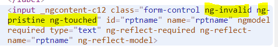
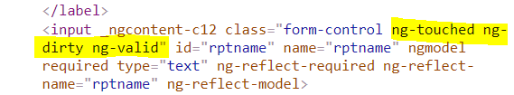

- https://chat.deepseek.com/a/chat/s/75474839-971c-4605-b025-6c4fbc1996b3

# Template driven Form
## 1. intro
- form - data-entry experience
- two-way data binding, change tracking, validation, and error handling.
- Angular gives JS representation of Form-Object
  - with **form-data** in K,V format  
  - other **metadata** 
    - for validation
    - for add styling
- TD, where we define the form structure and validation rules **directly in the template** :point_left:
- Angular infers the form-object from template
---


## 2. Create
- import **FormModule**
  - it will detect the `<form>` 
  - create JS-rep of form automatically. 
  - register **form** to **ngForm** directive :point_left:
  - register **controls** using **ngModel** directive :point_left:
    - FormGroup-1
      - control-1
      - control-2
      - ...
    - FormGroup-2
      - ...
  - Get access to JS-rep using below steps.
    - **@viewChild('formRef') form1 : NgForm**
      - form1.path( { })
      - form1.patch( { })
      - form1.reset()
---
## 3. Form validation
- HTML5 -  validation  - skip
- put **directive** : email, min, max, etc
- **custom validator**
  - directive 
  - provide: NG_VALIDATORS

```typescript
class Validators {
  static min(min: number): ValidatorFn;
  static max(max: number): ValidatorFn;
  static required(control: AbstractControl<any, any>): ValidationErrors | null;
  static requiredTrue(control: AbstractControl<any, any>): ValidationErrors | null;
  static email(control: AbstractControl<any, any>): ValidationErrors | null;
  static minLength(minLength: number): ValidatorFn;
  static maxLength(maxLength: number): ValidatorFn;
  static pattern(pattern: string | RegExp): ValidatorFn;
  static nullValidator(control: AbstractControl<any, any>): ValidationErrors | null;
  static compose(validators: null): null;
  static compose(validators: (ValidatorFn | null | undefined)[]): ValidatorFn | null;
  static composeAsync(validators: (AsyncValidatorFn | null)[]): AsyncValidatorFn | null;
}
```

- Angular maintains the **state**  
  - form  : valid, dirty, touched, etc
  - formControl level. valid, dirty, touched, etc
- also add css classes





---
## 4. Example
### Example-1 (old)
```html
  <form #formRef="ngForm" (ngSubmit) = "f1(formRef) > 
    <!-- automatically create FormControl instances -->
    <div id="group-key-1" #group1Ref= ngModelgroup [(ngModelgroup)]="group-1-data">
      <input name="key1" [(ngModel)]="feild1" ngNativeValidate>
    </div>

    <div id="group-key-1" #group1Ref= ngModelgroup [(ngModelgroup)]="group-1-data">
      <input name="key2" #feild2="ngModel" [(ngModel)]="feild2">
      <span class="error-style-1" *ngIf="!feild2.valid && feild2.touched">Please enter a valid email!</span>
    </div>

    <button type=submit > sunmit </button>
  </form> 
  <!--Since SPA  - Dont add - action (GET,POST,etc)-->
  
``` 
```typescript
  f1(formRef : ElementRef) => { 
    console.log(formRef)
  }
```
```css
error-style-1 {
  border: 1px solid red;
}
```
---
### Example-2 :yellow_circle:
#### user-form.component.html
```html
<form #myForm="ngForm" (ngSubmit)="onSubmit(myForm)">
  <div class="form-group">
    <label for="name">Name</label>
    <input type="text" id="name" name="name" [(ngModel)]="formData.name" required>
    <div *ngIf="myForm.controls['name']?.errors?.required && myForm.controls['name']?.touched">
      Name is required
    </div>
  </div>

  <div class="form-group">
    <label for="email">Email</label>
    <input type="email" id="email" name="email" [(ngModel)]="formData.email" required email>
    <div *ngIf="myForm.controls['email']?.errors && myForm.controls['email']?.touched">
      <div *ngIf="myForm.controls['email']?.errors?.required">Email is required</div>
      <div *ngIf="myForm.controls['email']?.errors?.email">Invalid email format</div>
    </div>
  </div>

  <!--ngModelGroup-->
  <div class="form-group" ngModelGroup="address" #address="ngModelGroup">
    <div class="form-group">
      <label for="street">Street</label>
      <input type="text" id="street" name="street" [(ngModel)]="formData.address.street" required>
    </div>

    <div class="form-group">
      <label for="city">City</label>
      <input type="text" id="city" name="city" [(ngModel)]="formData.address.city" required>
    </div>

    <div *ngIf="address.invalid && address.touched" class="error">
      Address information is incomplete
    </div>
  </div>

  <button type="submit" [disabled]="myForm.invalid">Submit</button>
</form>
```

#### class UserFormComponent
```typescript
import { Component } from '@angular/core';

@Component({  selector: 'app-user-form',  templateUrl: './user-form.component.html'})
export class UserFormComponent
 {
  // Default form values
  formData = {
    name: 'John Doe',
    email: '',
    address: {
      street: '123 Main St',
      city: 'New York'
    }
  };

  onSubmit(form: ngForm) {
    if (form.valid) { }
  }

  // Reset form to default values
  resetForm(form: ngForm) {
    form.reset();
    this.formData = {
      name: 'John Doe',
      email: '',
      address: {
        street: '123 Main St',
        city: 'New York'
      }
    };
  }

  // Patch form with partial data
  patchForm() {
    this.formData = {
      ...this.formData,
      name: 'Jane Smith',
      address: {
        ...this.formData.address,
        city: 'Los Angeles'
      }
    };
  }
}
```

#### Custom Validator Directive
validate(control: **AbstractControl**): :point_left:
```typescript
import { Directive } from '@angular/core';
import { NG_VALIDATORS, Validator, AbstractControl } from '@angular/forms';

@Directive({
  selector: '[appPasswordValidator]',
  providers: [{
    provide: NG_VALIDATORS,
    useExisting: PasswordValidatorDirective,
    multi: true
  }]
})
export class PasswordValidatorDirective implements Validator {
  validate(control: AbstractControl): { [key: string]: any } | null {
    const value = control.value;
    const hasNumber = /\d/.test(value);
    const hasUpper = /[A-Z]/.test(value);
    const hasLower = /[a-z]/.test(value);
    const valid = hasNumber && hasUpper && hasLower;
    
    if (!valid) {
      return { passwordStrength: true };
    }
    return null;
  }
}
```


