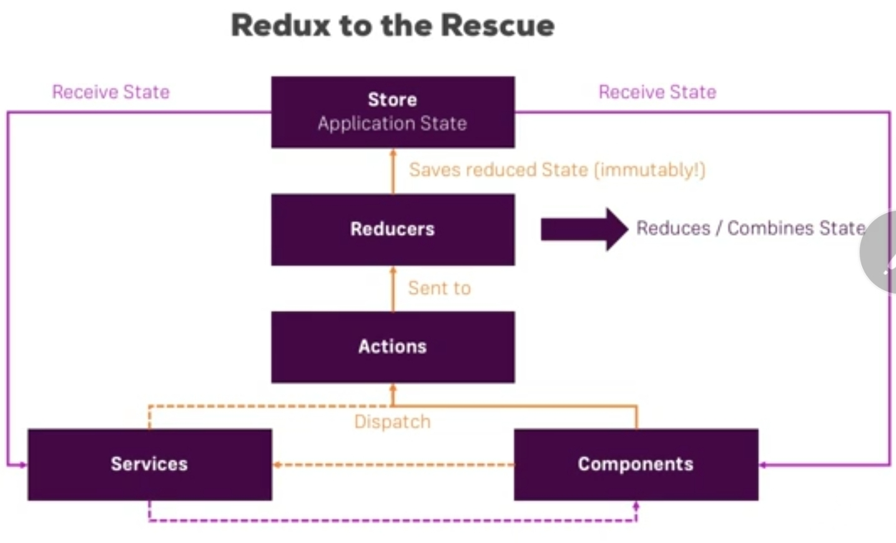
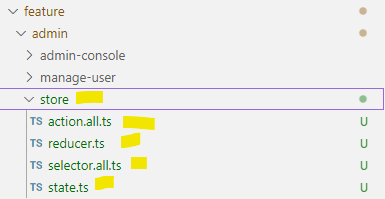

- [https://chat.deepseek.com/a/chat/s/37c732b1-738a-4167-9b95-046ad410f60d](https://chat.deepseek.com/a/chat/s/37c732b1-738a-4167-9b95-046ad410f60d)

---
# redux
- NgRx is a reactive state management library for Angular applications

## A. intro
-  state management pattern inspired by Flux but simplified.
- **3 core principle**
  - **Single source of truth**: The entire application state is stored in one object tree (the store)
  - **State is read-only**: The only way to change state is by emitting an action
  - **Changes are made with pure functions**: Reducers specify how state changes in response to actions

## B. Components
```txt
Store:      The single source of truth for application state
Actions:    Describe state changes
Reducers:   Pure functions that handle state transitions
Selectors:  Pure functions for querying the store
Effects:    Handle side effects (like API calls)
```



### B.1 Effect
- https://chat.deepseek.com/a/chat/s/6f5f7c58-5281-4f57-9f01-af30d5c34007
#### concept
```
** Without side effects:**

  Without side effects
  User clicks "Add to Cart" button
  Action dispatched: ADD_TO_CART
  Reducer updates local cart state
  Done

** With side effects:**

  User clicks "Add to Cart" button
  Action dispatched: ADD_TO_CART
  Reducer updates local cart state
  Side effect kicks in:
    Makes API call to update server-side cart
    On success: dispatches ADD_TO_CART_SUCCESS
    On failure: dispatches ADD_TO_CART_FAILURE
  Reducer handles success/failure to update UI state (loading spinner, error message)
```

```
** Without side effects:**

LoginButtonClick → LoginAction → authReducer updates state to { loggingIn: true }
→ UI shows spinner → [WHO STOPS SPINNER - WHO CALLS THE API?]

** With side effects:**

LoginButtonClick → LOGIN_ACTION
├─→ authReducer sets { loggingIn: true } // without validation to backend
└─→ LoginEffect sees LOGIN_ACTION
   → Makes API call
   → On success: dispatches LoginSuccessAction
   → On failure: dispatches LoginFailureAction
```

#### code example

```typescript
// ==== cart.actions.ts === 

import { createAction, props } from '@ngrx/store';
import { Product } from '../models/product';

// Regular action (handled by reducer)
export const addToCart = createAction(  '[Cart] Add to Cart',  props<{ product: Product }>());

// Success action (dispatched by effect)
export const addToCartSuccess = createAction(  '[Cart] Add to Cart Success',  props<{ product: Product }>());
// Failure action (dispatched by effect)
export const addToCartFailure = createAction(  '[Cart] Add to Cart Failure',  props<{ error: string }>());

//  ==== cart.effects.ts === 

import { Injectable } from '@angular/core';
import { Actions, createEffect, ofType } from '@ngrx/effects';
import { CartService } from '../services/cart.service';
import { addToCart, addToCartSuccess, addToCartFailure } from './cart.actions';
import { catchError, map, mergeMap } from 'rxjs/operators';

@Injectable()
export class CartEffects {
  addToCart$ = createEffect(() =>
    this.actions$.pipe(
      ofType(addToCart), // ← Only addToCart actions pass through
      // This code only runs for addToCart actions
      mergeMap(action =>
        this.cartService.addToCartAPI(action.product).pipe(
          map(product => addToCartSuccess({ product })),
          catchError(error => of(addToCartFailure({ error: error.message })))
        )
      )
    )
  );

  constructor(
    private actions$: Actions,
    private cartService: CartService
  ) {}
}

// ========= reducer =======

const initialState: CartState = {  items: [],  loading: false,  error: null};

export const cartReducer = createReducer(
  initialState,
  
  on(addToCart, state => ({ ...state, loading: true })),
  
  on(addToCartSuccess, (state, { product }) => ({
    ...state,
    items: [...state.items, product],
    loading: false
  })),
  
  on(addToCartFailure, (state, { error }) => ({
    ...state,
    error,
    loading: false
  }))
);

```

---
# C. developer Guide
## C.1. install NgRx Packages
```txt
ng add @ngrx/store@latest
ng add @ngrx/store-devtools@latest
ng add @ngrx/effects@latest
ng add @ngrx/schematics@latest
```

## C.2. project Context
```txt
src/
├── app/
│   ├── core/
│   ├── feature/
│   │   ├── admin/
│   │   │   ├── state/
│   │   │   │   ├── admin.actions.ts
│   │   │   │   ├── admin.reducer.ts
│   │   │   │   ├── admin.selectors.ts
│   │   │   │   └── admin.state.ts
│   │   │   ├── admin.module.ts
│   │   │   └── components/
│   │   ├── feature2/
│   │   │   ├── state/
│   │   │   └── ...
│   ├── shared/
│   ├── reducer/index.ts  --> #1 app core state | "ng add @ngrx/store@latest" command created this file <<<
│   └── app.module.ts --> #2 Register core, features(admin,feature-2,etc), shared, etc all modules
```
- **final** state will look like this (redux store)


---
### 1 :: create - App store
- app.module.ts -  import : [ StoreModule.forRoot({}), StoreDevtoolsModule.instrument() ]
- ng add @ngrx/store@latest
  - auto create - **reducer/index.ts**
  - **interface AppState {}** -- keep it empty
  - **ActionReducerMap<AppState> = {}** -- keep it empty
```typescript
import {   ActionReducerMap,  MetaReducer} from '@ngrx/store';
import environment from '../../environments/environment';

export interface AppState {}  
export const reducers: ActionReducerMap<AppState> = {};
export const metaReducers: MetaReducer<AppState>[] = !environment.production ? [] : [];
```


### 2 :: create - feature store


#### 2.1 State.ts
- interface : **FeatureAdminState** 
```typescript
export interface FeatureData1 {        module: String        purpose: string        section: string    }
export interface FeatureData2 {        module: String        purpose: string        section: string    }
export interface FeatureData3 {        module: String        purpose: string        section: string    }

export interface FeatureAdminState {
    "data1": FeatureData1,
    "data2": FeatureData2,
    "data3": FeatureData3
}
```
---
#### 2.2  ActionReducerMap
- featureStateName: string = 'feature-module-admin'
- featureAdminReducerStateMap: **ActionReducerMap**<`FeatureAdminState`>
- notice: **reducer/s** : featureData1_Reducer, featureData2_Reducer, featureData3_Reducer
  - functions to set initial value
  - update state data by **action**
  - featureData1_Reducer will update only - FeatureData1, and so on.

```typescript
import { ActionReducerMap } from '@ngrx/store';
import { featureData1_Reducer, featureData2_Reducer, featureData3_Reducer } from './reducer';

export const featureStateName = 'feature-module-admin';
export const featureAdminReducerStateMap: ActionReducerMap<FeatureAdminState> = {
    "data1": featureData1_Reducer, 
    "data2": featureData2_Reducer,
    "data3": featureData3_Reducer 
};
```

---
#### 2.3  Action (class)
- naming conventions like [Source] Event
```typescript
import { Action } from '@ngrx/store';
import { FeatureData1, FeatureData2, FeatureData3 } from './state';

export enum FeatureAdminActionTypes {
    ActionLoadData1 = '[feature admin ] ActionLoadData1 Action' ,
    ActionLoadData2 = '[feature admin ] ActionLoadData2 Action' ,
    ActionLoadData3 = '[feature admin ] ActionLoadData3 Action'
};

export class FeatureAdmin_LoadData1_Action implements Action 
{
    readonly type = FeatureAdminActionTypes.ActionLoadData1;
    payload : FeatureData1
    constructor(private d: FeatureData1) {this.payload = d;}
}

export class FeatureAdmin_LoadData2_Action implements Action 
{
    readonly type = FeatureAdminActionTypes.ActionLoadData2;
    payload : FeatureData2
    constructor(private d: FeatureData2) {this.payload = d;}
}

export class FeatureAdmin_LoadData3_Action implements Action 
{
    readonly type = FeatureAdminActionTypes.ActionLoadData3;
    payload : FeatureData3
    constructor(private d: FeatureData3) {this.payload = d;}
}
```

---
#### 2.4 Reducer (function)
- initial state
- update state 
- **Immutability** : Always return new state objects in reducers rather than mutating existing state
```typescript
import { FeatureAdminActionTypes  } from './action.all';
import { FeatureData1,FeatureData2,FeatureData3 } from './state';

const initialState = {
        module: "admin",
        purpose: "admin task",
        section: " "
};

export function featureData1_Reducer(state :FeatureData1 = initialState, action: any): FeatureData1 
{
    switch (action.type) 
    {
      case FeatureAdminActionTypes.ActionLoadData1 : return {...state, section: "data 1"};
        
      default: return state;
    }
}

export function featureData2_Reducer(state :FeatureData2 = initialState, action: any): FeatureData2
{
    switch (action.type) 
    {
      case FeatureAdminActionTypes.ActionLoadData2 : return {...state, section: "data 2"};
        
      default: return state;
    }
}

export function featureData3_Reducer(state :FeatureData2 = initialState, action: any): FeatureData3
{
    switch (action.type) 
    {
      case FeatureAdminActionTypes.ActionLoadData3 : return {...state, section: "data 3"};
        
      default: return state;
    }
}

```

---
#### 2.5 Selector + Obseravble
- create small, focused selectors and compose them for more complex queries
```typescript
import { createFeatureSelector, createSelector } from '@ngrx/store';
import { FeatureAdminState } from './state';

export const featureAdminState = createFeatureSelector<FeatureAdminState>('counter');

  export const selectdata1 = createSelector(  featureAdminState,  (state) => state.data1);
  export const selectdata2 = createSelector(  featureAdminState,  (state) => state.data2);
  export const selectdata3 = createSelector(  featureAdminState,  (state) => state.data3);
 
 const data1$ = this.store.select(selectdata1);
 const data2$ = this.store.select(selectdata2);
 const data3$ = this.store.select(selectdata3);
```

---
#### 2.6 StoreModule.forFeature() :point_left:
- **StoreModule.forFeature**('feature-module-admin', featureAdminReducerStateMap),
```typescript
@NgModule({
  imports: [
    CommonModule, AdminRoutingModule, SharedModule,
    StoreModule.forFeature(featureStateName, featureAdminReducerStateMap),
  ],
  exports: [AdminRoutingModule],
  declarations: [AdminConsoleComponent, ManageUserComponent]
})
export class AdminModule { }
```

---
#### 2.7 Dispatch Action
```typescript
import { Store } from '@ngrx/store';

constructor(private store: Store) {}

payload = { ... }
this.store.dispatch(new FeatureAdmin_LoadData2_Action({ payload }));

```

---
## C.3 New Syntax
### Action
```typescript
==== Action ====
import { createAction, props } from '@ngrx/store';

export const reset = createAction('[Counter] Reset');

payload: Counter = {};
export const setValue = createAction('[Counter] Set Value',  props<payload>() );
```

### Reducer

```typescript
import { createReducer, on } from '@ngrx/store';
import * as CounterActions from './counter.actions';
import { CounterState, initialState } from './counter.state';

export const counterReducer = createReducer(
  initialState,
  on(Action1, (state) => ({...state, prop_1="new-value"  })),
  on(Action2, (state) => ({...state, prop_2="new-value"  })),
  ...
);
```


