## How JS works behind the scene.

### A. Hoisting
- JS loades `Exection stack` for execution thread.
- then declares the `property` and `method` 
- then executes the code flow.
- `note`: if var is used in code without declation then JS declares thar property in global `execution stack`.

### B. **Execution Stack**
1. Understand it with for below prg:
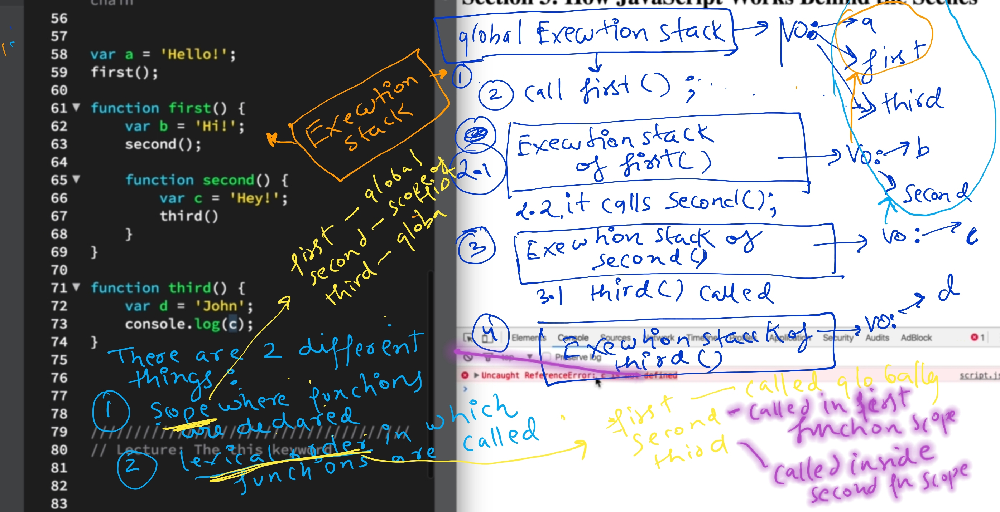
```
global stack --> 
- method declaration: first(), third()
- property declation : a


first() method stack --> 
- method declaration: second()
- property declation : b
```

- first() is called at line 59
- New Execution stack will be formed for first(), for its execution, on top of global stack.
- Again declaration will happen, followed by execution then.

> `note 1` : property/method declared in parent stack will be avialble to child (and nested child). 
See nested flow eg:

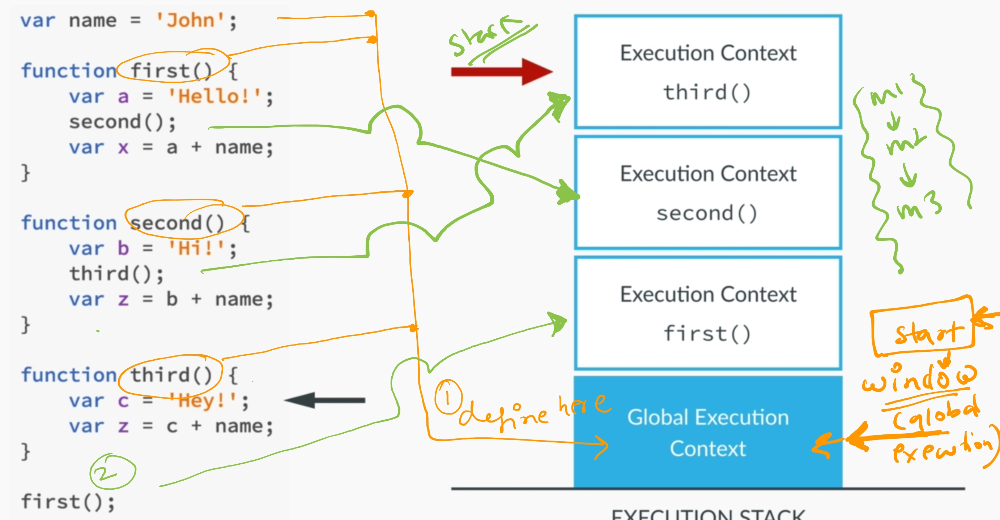

> `note 2` : `method-expression` wont be declared inside stack. eg: line 13 below.

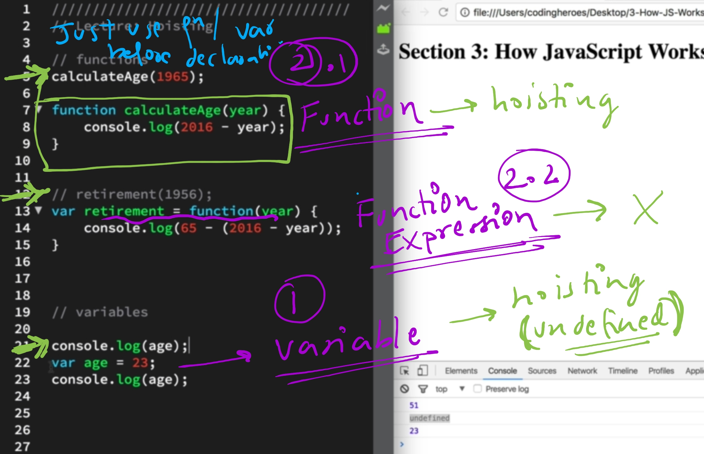

****

2. Theory to understand it:
- default stack is `global` stack to execute the current JS code. it act as starting execution point.
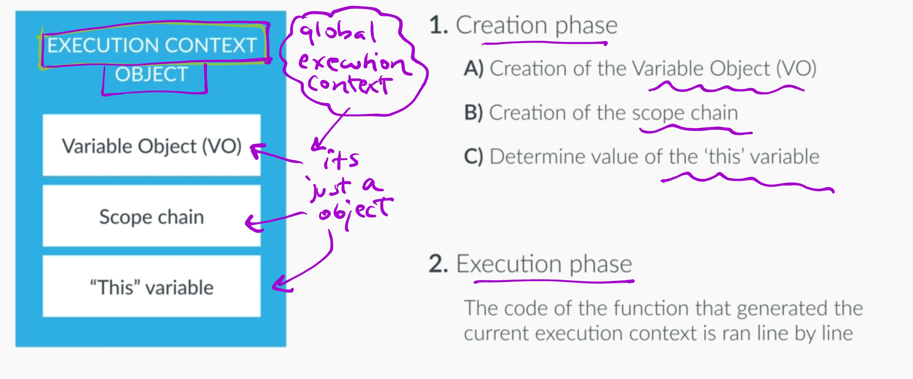

> ## 2.1 VO 

- creation Phase: VO object holds 3 things --> `argument`, `funtion` and `property`
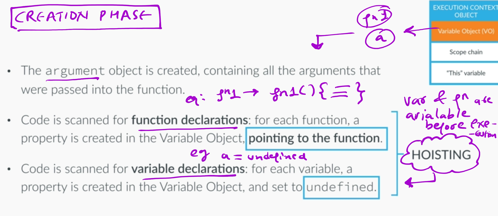
- Another simple eg:
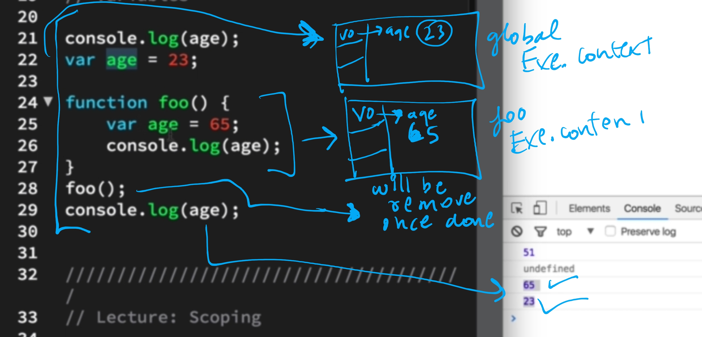

> ## 2.2 Scope chain

- in JS, there are only 2 scope - global and local(each function)
- lexical scoping chain --> if function defined inside anothor function, then it will be scope inside scope. 
- execution stack defines scope chaining.
- It will to understand where to access particular method.proprty. simple rule --> child scope will have access to parent scope, thats all. 
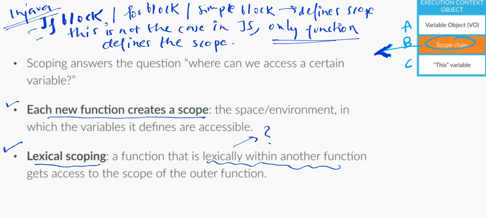
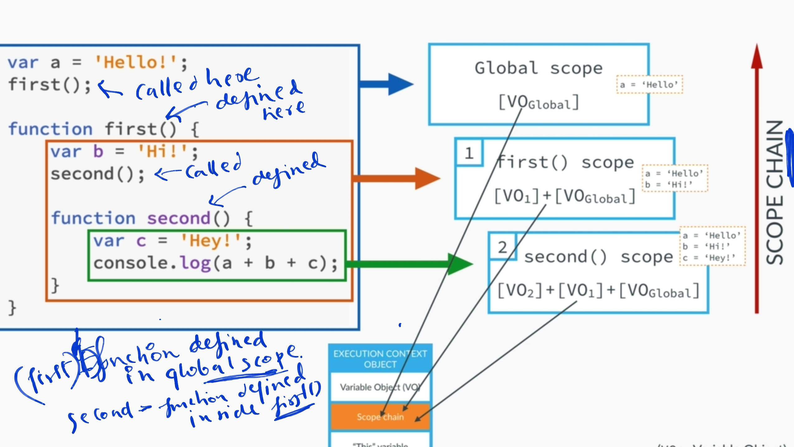
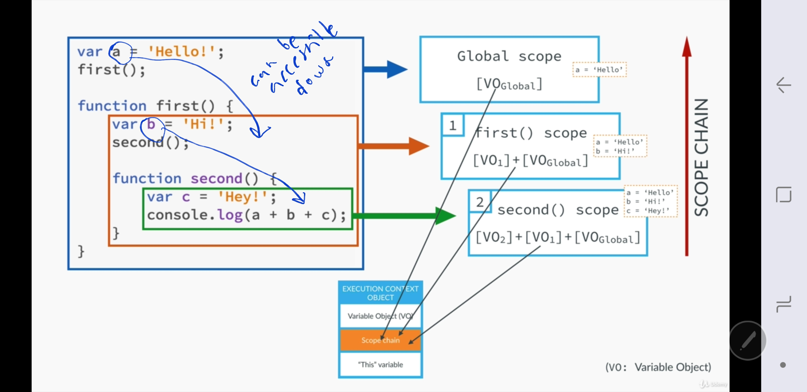

- note: difference between scope chain and execution stack:
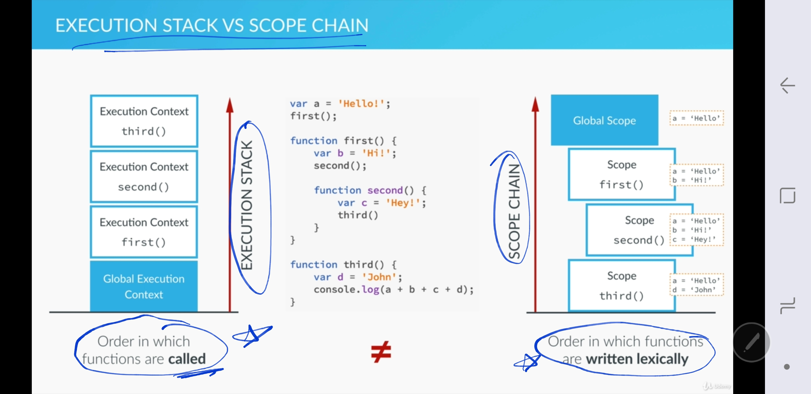

> ## 2.3 this

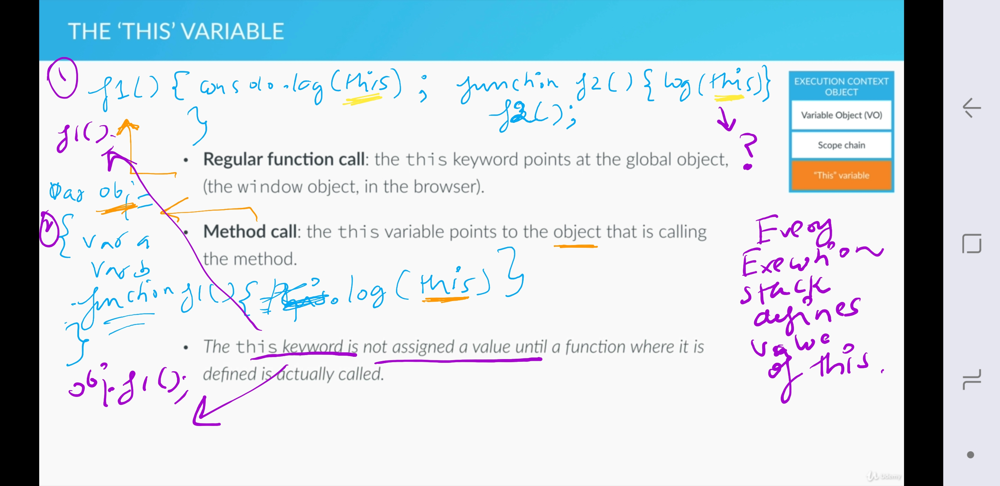

- `this` will be `window` object for prg mentioned at point 2.
- this will be john object in below prg:
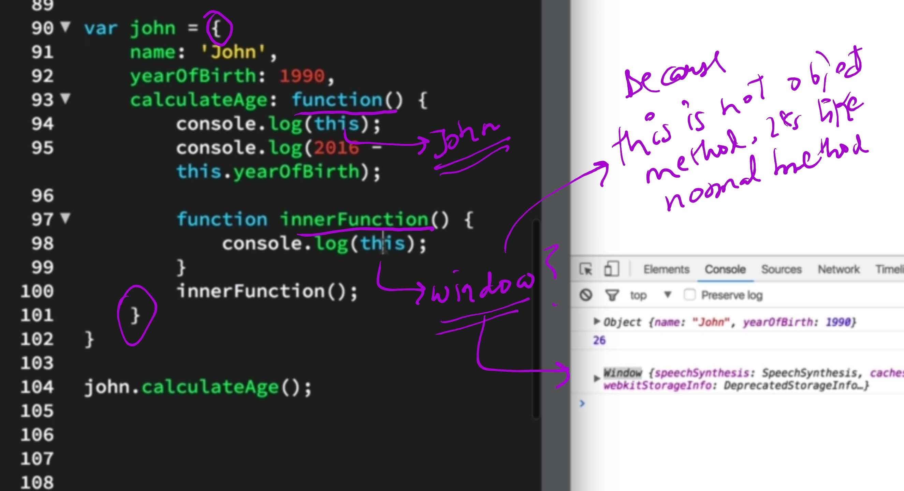

******
