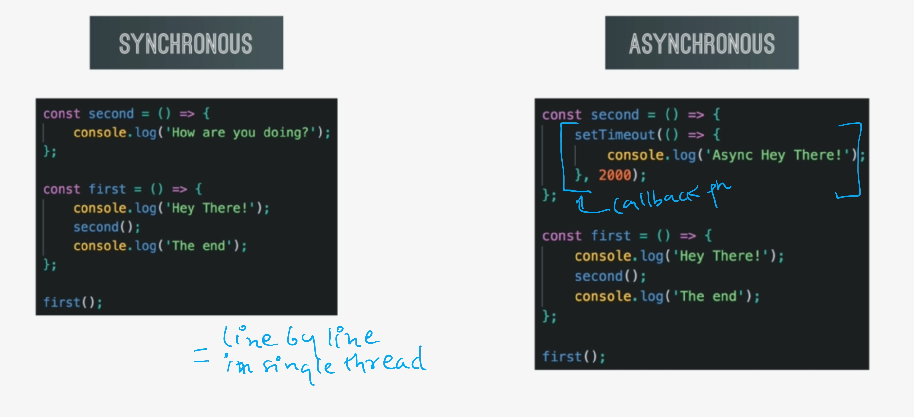
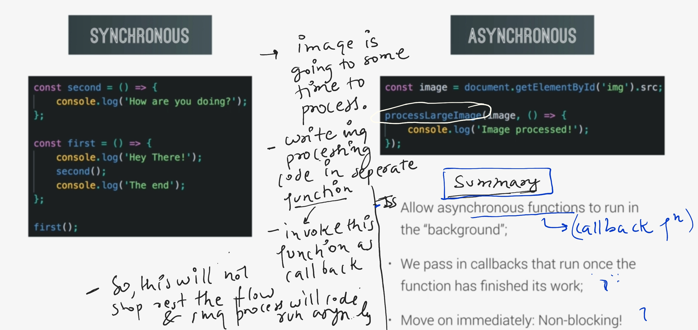

## A. Async vs Sync code

- Async: don't block the main thread. eg:
  - setTimeout
  - fetch (promise)
  - <Image src="http//....">
  - <script src="script.js" defer></script> // The script downloads in parallel with HTML parsing
  - custome promise
  - observable in ng (continous stream)
    ...




---

## B. How JS handle ASYNC call behind the scene

- JavaScript is single-threaded, but it handles asynchronous operations efficiently using an event loop and callback queue system. Here's how it works.
- Concurrency Model: Achieved through the event loop rather than multi-threading
- Priority: Microtasks (promises) have higher priority than regular tasks

### Core Components

```
Call Stack:     Tracks the currently executing functions (LIFO structure)
Web APIs:       Browser-provided APIs (setTimeout, fetch, DOM events, etc.)
Callback Queue (Task Queue): Holds callbacks waiting to be executed
Microtask Queue: For promises and mutation observers (higher priority)-
Event Loop:     Coordinates the whole process
```

### Async Process Flow

- When code hits an async operation (setTimeout, fetch, etc.), it's handed off to the Web API environment (outside JS engine)
- The main thread continues executing subsequent code
- Web API Completion
  - When the async operation completes, its callback is placed in:
    - Callback/task queue (for setTimeOut,etc)
    - Microtask queue ( for promises )
- event loop checks:
  - First processes all microtasks
  - Then processes one task from the callback queue
