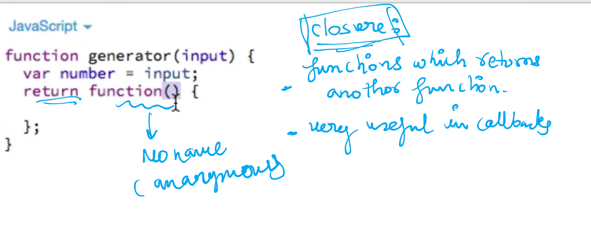
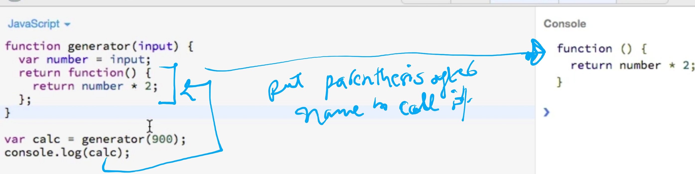
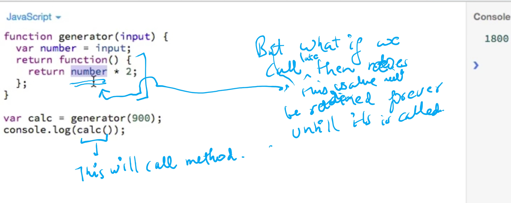
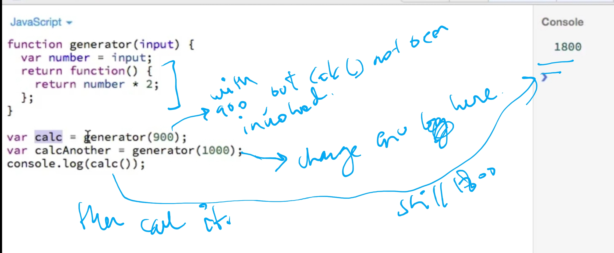
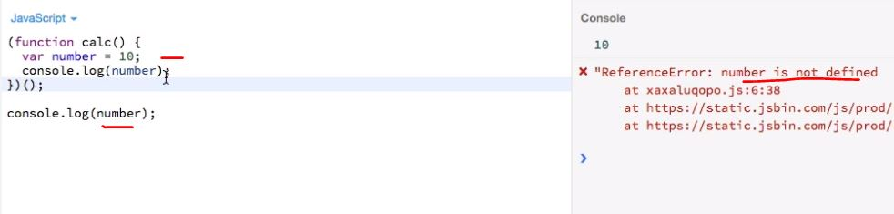
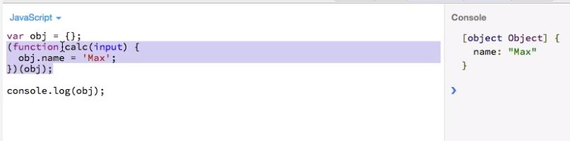
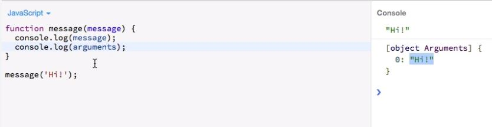
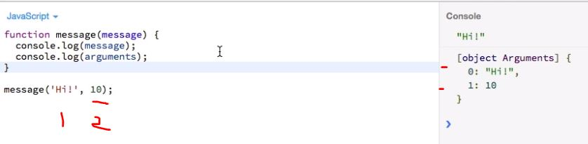
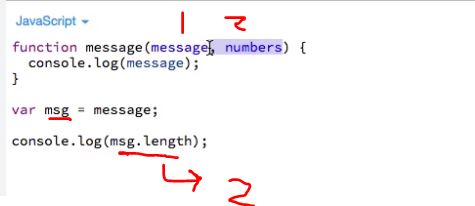
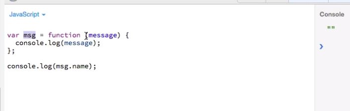

## A. CLOSURES

- intro:
  - A closure is a fundamental concept in JavaScript that allows functions to "remember" and access their lexical scope even when they're executed outside that scope
- Function which returns anothor function  
  
- get retuned function from closure
  
- invoke retuned function
  
- 3 steps: closure maintains the state of return functions.

1. run the closure with arg1 and get `retuned function1` from closure.
2. Run the closure again with agr2 and get another `retuned function2`.
3. run the `retuned function1`.
   

---

## B.IIFEs - Immendiately invoked Function Execution

- which function get executed Immendiately.

```
//1. Normal Function
function(){     console.log("hello");  }

//2. IIFEs
( function(){    console.log("hello");  } )();

//3. IIFEs with Arg
( function(arg){     console.log(arg);  } )("hello2");
```

- IIEFs have there own local scope:
  

- using global scoped obj in IIEFs scope:
  

---

## C. Extra : Built-in mehods and properties

### 1. `arguments`




- technically arguments are object [check above output {}], but act as array.

```
console.log(arguments)

console.log(arguments[0])
console.log(arguments[3]) // undefined

console.log(arguments.length) //2
```

### 2. function name and arg length

```
msg.name //message whuich is fn name
msg.length // 2
```



- name of anonymous function
  

---

[cheatsheet](../999_assets/asset_js/Functions-Cheat-Sheet.pdf)
