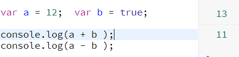
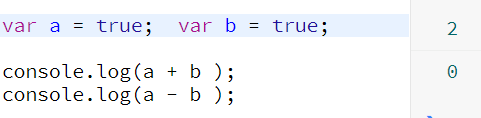
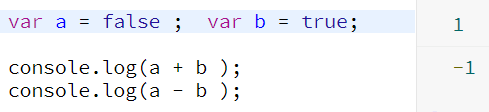
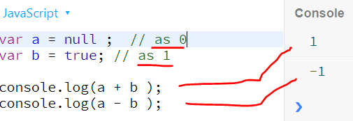
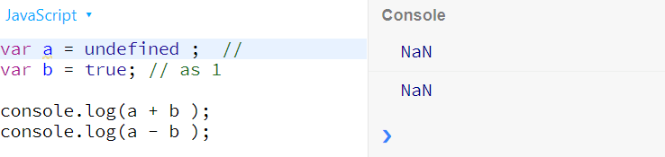
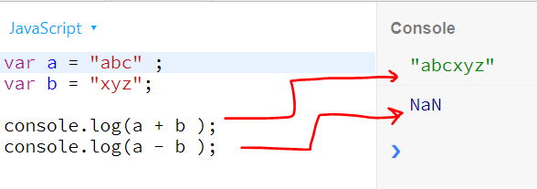
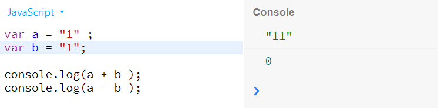
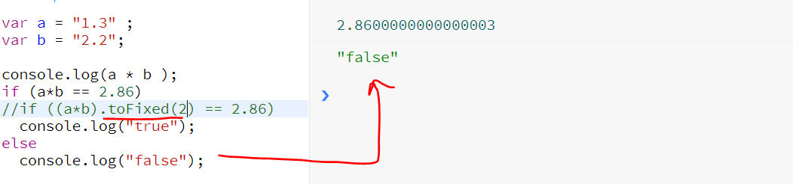

## JavaScript (ES)

### Fundamental

- 3 techs for web development
  - `css(style)`
  - `html(content)`
  - `JS (logic/programming` -- to add dynamic and interactive effect, **DOM manipulation**,etc
- lightweight(precompiled) scripting language for browser.
- functional programming
  - pass function as argument
  - return Function
- OOPs :: ES6 - classes, interface, inheritabnce, abstraction, etc.
- **JS engine**:
  
- online playground: [https://jsbin.com/](jsbin.com)
- ES5 - Supported by all Browser.
- ES6 - Few browser does not support it and transcompile it to ES5 format brfore run. **pollyfills**
- JS run on Server by Node.js, which also extends core feature of JS and added more capabilty.
- ES - EcmaScript - it provide the specification and JS build the progming constructs as per standards and specification provided by ES
- **Hoisting** - JS declares the variable and method inside Excecution stack before excution.

```
--- keep just before `</body`
--- Order matters ---
<script scr=file1.js
<script scr=file2.js
 ---
 `<script f1()</script` - f1() will get execute.
`<script scr="" f1()</script` - f1() will not run.
```

### Data Types

#### 1. console.log(typeof a)

```
var a = Infinity, NaN, 0, -1, 1.1, - `number`
var a = undefined - `undefined`
var a = Null , {}, {a:'a', b:1}, [1,2,3] - `Object`
var a = "1" , '1' - `string`
var a = true -- `boolean`
var a = function() {} - `function`
```

#### 2. null vs Undefined

- Both have internally same value. hence `if(null == undefined) : true.`
- Both have diff type as shown above. hence `if(null === undefined) : false.`
- `var a = undefined` : technically assign it but no purpose.

#### 3. NaN

- its a error return by JS while mathematical error on number types. NaN is of `number` type. technically we can say its undefined number in JS world.
- `if (NaN == NaN) // false`

#### 4. assign function declaration to var.

- functional declaration
- function call
- function assign (fn expression)
- regular vs arrow function (short hand, nut lexical this)

```
var a = function calc(var1, var2){
  return var1 + var2;
};

console.log( typeof a);  //"function"
console.log( a(2,3)); // 5
console.log( calc(2,3)); //"ReferenceError: calc is not defined
```

#### 5. boolean type

- true and false.
- Number as boolean : false internally represents **zero** value, And true internally represent **non-zero number**.

```
if(0 == false){  console.log( 'true');} ;//true

if(1 == true){  console.log( 'true');} ;//true
if(-1 == true){  console.log( 'true');}; //true
if(100 == true){  console.log( 'true');} ;//true

if(1 == '1') - true
if(1 === '1') - false
```

- Use number/true inter-changebelly as CONDITION.

```
if(true) {  console.log( 'true');} //true
if(6) {  console.log( 'true');} //true
if(-2) {  console.log( 'true');} //true
```

- But types are not same

```
if (6 == true) {  console.log( 'true');} //true
if (6 === true) {  console.log( 'true');} //nothing
```

- All string treated as true.

```
if("abc")
  console.log( 'true'); //output
else
  console.log( 'false');
```

- NULL as false

```
if(null)
  console.log( 'true');
else
  console.log( 'false'); //output
```

#### 6. array

#### 7. Addition / subtraction

1.  
2.  
3.  
4.  Add/sub with NULL - 0
    
5.  Add/Sub with undefined - NaN
    

6.  Sub string1/number with string2 - NaN/worked
    
    

7.  Sub string1 with number - Js will convert string to number
    

#### 8. Multiple:

1.  

2.  withString

```
var a = "1.3" ;
var b = "abc";
console.log(a * b ); //NaN

var a = "1.3" ;
var b = "2.2";
console.log(a * b ); //2.8600000000000003
```

3. with null

```
var a = "1.3" ;
var b = null;
console.log(a * b ); //0 a null is 0 value
```

4. with Infinity

```
var a = "1.3" ;
var b = Infinity;
console.log(a * b ); // Infinity
```

#### 9. JS rules (on comparision)

Null/undefined cant be compared and alwys return false whenever being compared. But have one exception:
`if (null == undefined) // true` - both have interanlly same value.

---

### Types / Scopes

#### Tpye

1. Primitive
2. Reference

#### Scopes

1. Local - within function.
2. Global - within window.

- if `var` is not used then it will always global irrespective wherver variable is defined.
- local variable overrides the global variable if having same name.

---

Callback function concept : https://www.youtube.com/watch?v=Nau-iEEgEoM
