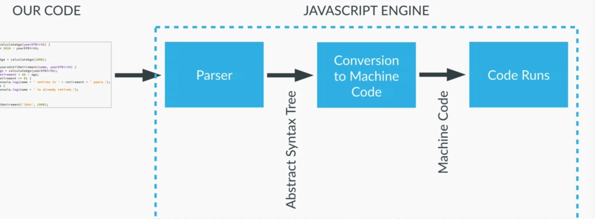

## 1. JS intro
- functional | lightweight | precompiled | scripting language for browser.
- online playground: [https://jsbin.com/](jsbin.com)
- **pollyfills**
- run on Server by Node.js
- **Hoisting** - JS declares the variable and method inside Excecution stack before excution.
- if var is not used, then it will be always global, irrespective wherver variable is defined.
- **scope** - local | global | block
- if (null == undefined) // true - both have internally same value.

---
## 2. JS engine



---
## 3. Data Types
### console.log(typeof a)
```
var a = Infinity, NaN, 0, -1, 1.1, - `number`
var a = undefined - `undefined`
var a = Null , {}, {a:'a', b:1}, [1,2,3] - `Object`
var a = "1" , '1' - `string`
var a = true -- `boolean`
var a = function() {} - `function`
```

### null vs Undefined
- Both have internally same value. hence `if(null == undefined) : true.`
- Both have diff type as shown above. hence `if(null === undefined) : false.`
- `var a = undefined` : technically assign it but no purpose.

### 3. NaN
- its a error return by JS while mathematical error on number types. 
- NaN is of number type. 
- technically we can say its **undefined number** in JS world.

### function type
- functional declaration vs
- function call vs
- function assign (fn expression) vs
- regular function vs
- **arrow function** (short hand, but **lexical this**)
```
var a = function calc(var1, var2){
  return var1 + var2;
};

console.log( typeof a);  //"function"
console.log( a(2,3)); // 5
console.log( calc(2,3)); //"ReferenceError: calc is not defined
```

#### boolean
- Number as boolean : false internally represents **zero** value, And true internally represent **non-zero number**.
```
if(0 == false){  console.log( 'true');} ;//true

if(1 == true){  console.log( 'true');} ;//true
if(-1 == true){  console.log( 'true');}; //true
if(100 == true){  console.log( 'true');} ;//true

if(1 == '1') - true
if(1 === '1') - false
```

- **string** === true.
```
if("abc")
  console.log( 'true'); //output
else
  console.log( 'false');
```

- **NULL** == false
```
if(null)
  console.log( 'true');
else
  console.log( 'false'); //output
```

### array
- [002_JS_ARRAYS.md](002_JS_ARRAYS.md)
