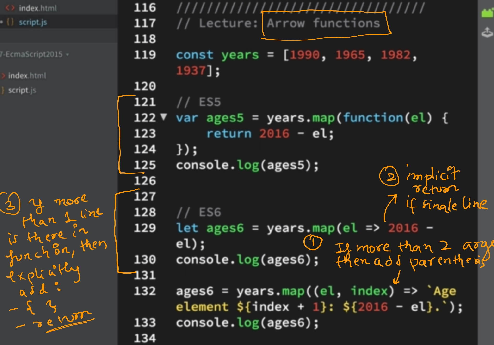
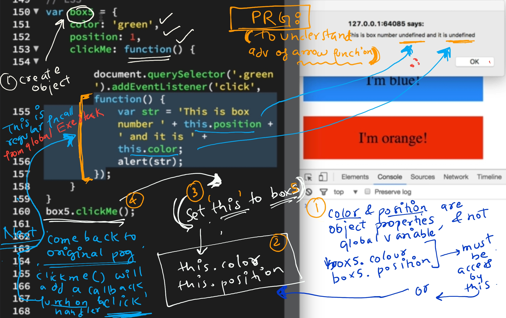
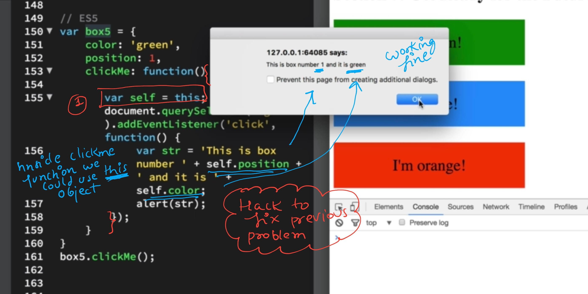
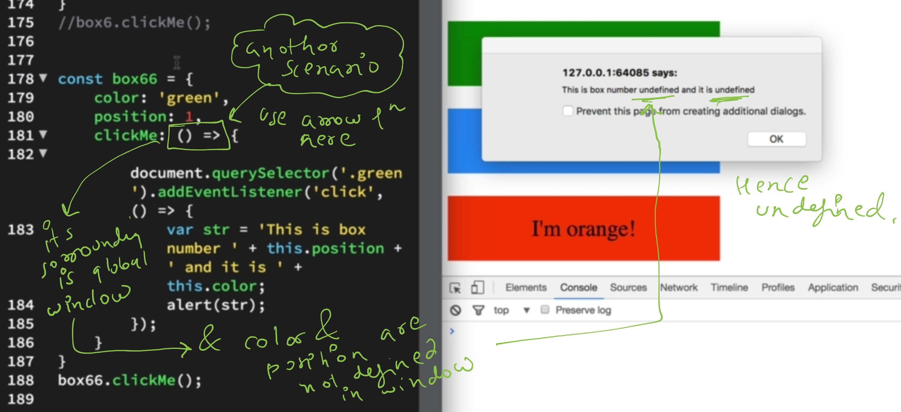

# ES6 +
- Modernized JavaScript for large-scale apps.
- <a href="https://chat.deepseek.com/a/chat/s/4b40513e-4cae-47fb-ba6f-14eef45b98ce" target="_blank">ES evolution</a>
- <a href="https://chat.deepseek.com/a/chat/s/2e0acf17-5fa4-46d1-beda-de307d4721a4" target="_blank">JS revision(Github)</a>

## class/Object

- Set default values for function parameters
  - function greet(name = "Guest") {... }
- short hand for object lietrals:
  - const obj = { name, greet() { /_ ... _/ } };
- class (Syntactic sugar over prototypes)
- Datatype:

  - const id = Symbol("id"); // new datatype
  - BigInt

- Object.values()/Object.entries()
- Object.fromEntries([['a', 1]]); // { a: 1 }

---

## 1. CONST
- immutable property

## 2. LET
- same as var but with block scope
- unlike var cannot use let before declaration
- block means --> if-block, for-block, normal-block - just { }
- With ES6 modules and block-scoped variables (let/const), some IIFE use cases are less common today.

### IIFE
- IIFE (Immediately Invoked Function Expression)
- JavaScript function that runs as soon as it's defined
- powerful pattern with several important use cases.
- key features
  - Creates a new scope for variables
  - Variables inside aren't added to the global scope

```
(function() {
  // Code here runs immediately
  console.log('IIFE executed');
})();

(function() {
  // Code here
}());

(async function() {
  const data = await fetch('https://api.example.com');
  console.log(data);
})();
```

---
## 3. String

- Template Literals : console.log(`Hello, ${name}!`);
- new methods : s.startswith(),endswith(),includes(), etc
- padStart()/padEnd()

---
### 4. Collection

- [1, 2, 3].at(-1); //negative index
- Map & Set
- Array.from(), Array.of(), find(), findIndex(), includes(), findIndex()
- Array.flat , flatMap

```
array1.findIndex( (e) => {} )
array1.find( (e) => {} )
[1, 2, 3].findLast(x => x < 3); // 2
[1, 2, 3,3,3].findLastIndex(x => x < 3) //4
```

---
### 5. For loop
- Better way to iterate.
```
let e of array1
const e of array1
for await (const item of asyncIterable) { ... }
```

---

## 6. Arrow Function
- Cannot Be Used as **Constructors fn**
- Unaffected by call, apply, bind
- implicit return
- have their own `this` - they lexically capture the this value from their surrounding context :point_left:

```
=== this ===
const obj = {
  value: 'Hello',
  arrowFunc: () => {
    console.log(this.value); // `undefined` (inherits from outer scope)
  }
};
obj.arrowFunc();


const obj = {
  values: [1, 2, 3],
  print: function() {
    this.values.forEach(() => {
      console.log(this); // `obj` (inherited from print's `this`)
    });
  }
};
obj.print();
```

- Use regular functions when:
  - You need method functions that access the object via this.
  - You need constructor functions
  - You want dynamic this binding
- Use arrow functions when:

  - You need to preserve the lexical `this` (event handlers, callbacks)
  - You want concise syntax for simple functions
  - working with functional programming patterns

---
## 7. Spread & Rest Operators

- const arr = [1, 2, ...[3, 4]] // Spread: Expand arrays/objects. eg:
  - combine 2 arrays
- function sum(a1, a2, ...nums) // Rest: Collect remaining arguments
  - var args
  - must be last arg
- const merged = { ...obj1, ...obj2 };

---
## 8. Modules (import/export)

- export const pi = 3.14; // Export
- import { pi } from './math.js'; // Import
- dynamic import : Load modules only when needed

```
button.addEventListener('click', async () => {
  const utils = await import('./utils.js');
  utils.doSomething();
});

if (user.isAdmin) {
  const adminModule = await import('./admin.js');
}

--ReactJs
const LazyComponent = React.lazy(() => import('./LazyComponent'));
```

---
## 9. Promises

```
- fetch(url)
  .then(response => response.json())
  .catch(error => console.error(error));
- Promise > finally ( cb )
- Promise.all, allSettled, allresolved, any, race
- asysnc/await
```

---
## 10. more

- #!/usr/bin/env node // Shebang syntax for Node.js scripts:
- try { ... } catch { /_ no parameter needed _/ }
- const value = input ?? 'default'; // Fallback for null/undefined:
- const name = user?.profile?.name;
- Dynamic Imports (import())
- globalThis : Unified way to access the global object (window, global, etc.).
- const billion = 1_000_000_000; // Improves readability
- throw new Error('Failed', { cause: originalError });
- 2 \*\* 3; // 8 (instead of Math.pow(2, 3))

# Screenshots(Extra)





