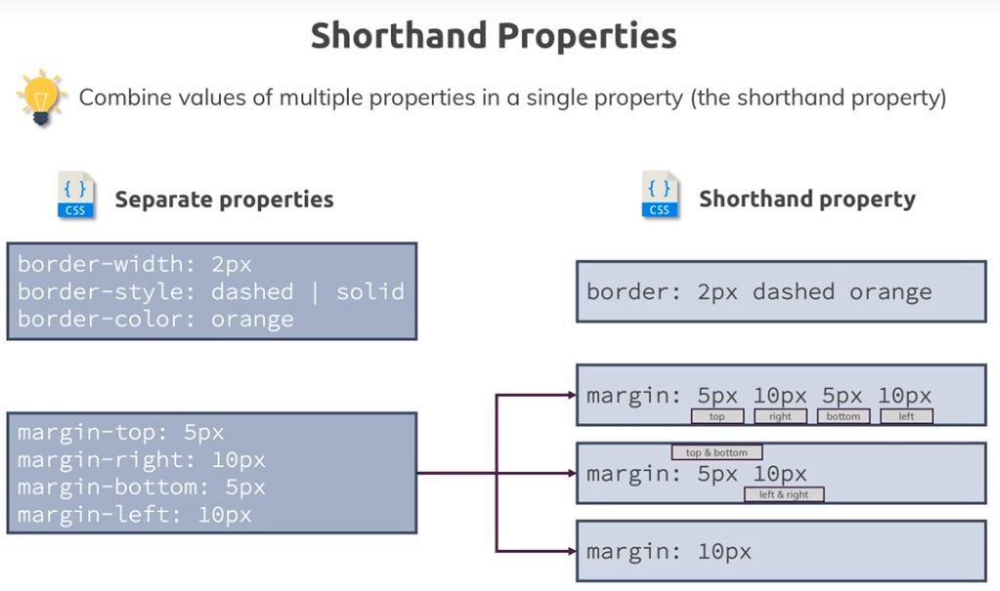
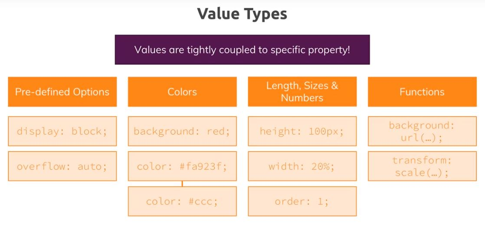
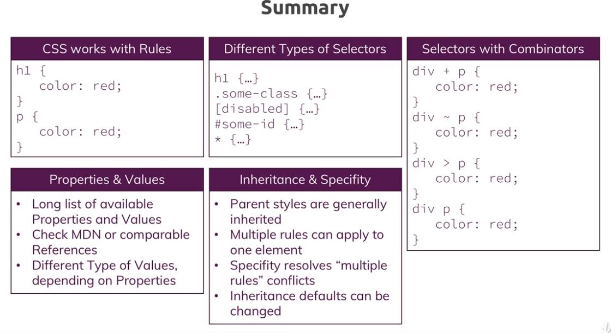
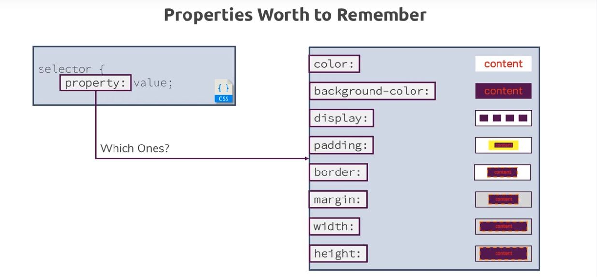

## Features:
[CSS - developer.mozilla.org](https://developer.mozilla.org/en-US/docs/Web/CSS)

1. html defines content, CSS defines styling - provide better look and interactive.
2. css styling **Rule** = **selector** (what to style) +  **declaration** (how to style)
3. case insensitive. 
4. properties(color,margin,etc) with shorthand:
 
5. value of properties: 

***

## Topic:

***

## 3 ways to add style
1. in-line : style attribute of any html tag. style=""
2. `<header></header>`
3. external css file embeded in html : `<link rel="stylesheet" href="maim.css" >`

## other
1. Add google font ->  Add URL and use it font-family.
2. id serves 2 purpose - as fragment and as selector to apply style.
3. Good preactice to check browser support for any property.
- MZN doc
- CAN I USE

## Summary:

## links:
Complete MDN CSS Reference (don't learn this by heart!): https://developer.mozilla.org/en-US/docs/Web/CSS/Reference

Find written CSS docs on MDN: https://developer.mozilla.org/en-US/docs/Web/CSS

Common CSS Properties Reference: https://developer.mozilla.org/en-US/docs/Web/CSS/CSS_Properties_Reference

CSS Combinators: https://developer.mozilla.org/en-US/docs/Learn/CSS/Introduction_to_CSS/Combinators_and_multiple_selectors

CSS Specifity: https://developer.mozilla.org/en-US/docs/Web/CSS/Specificity

CSS Box Model: https://developer.mozilla.org/en-US/docs/Learn/CSS/Introduction_to_CSS/Box_model

box-sizing : https://developer.mozilla.org/en-US/docs/Web/CSS/box-sizing

height & width: https://www.w3schools.com/css/css_dimension.asp

The display Property: https://developer.mozilla.org/en-US/docs/Web/CSS/display

Pseudo Classes : https://developer.mozilla.org/en-US/docs/Web/CSS/Pseudo-classes

Pseudo Elements: https://developer.mozilla.org/en-US/docs/Web/CSS/Pseudo-elements

## properties worth to remember:

