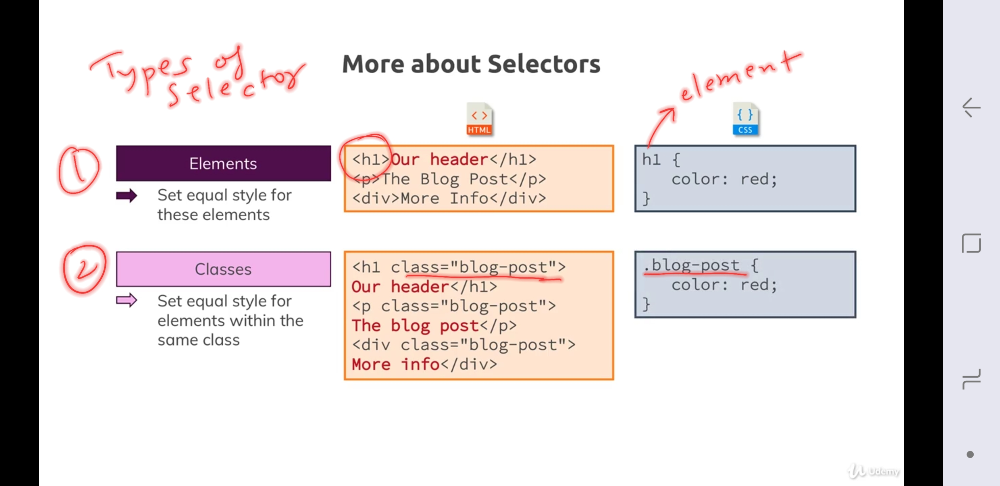
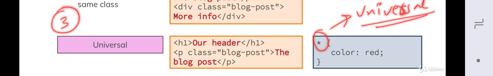
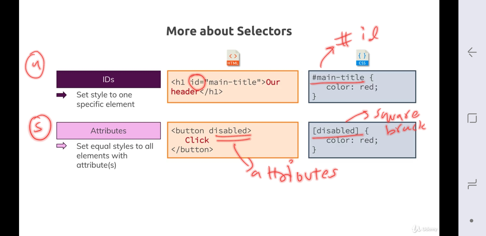
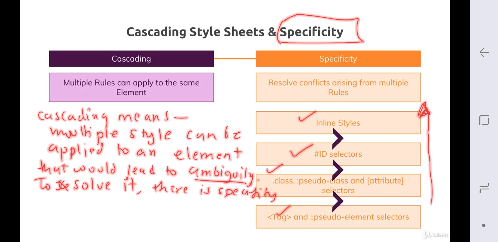
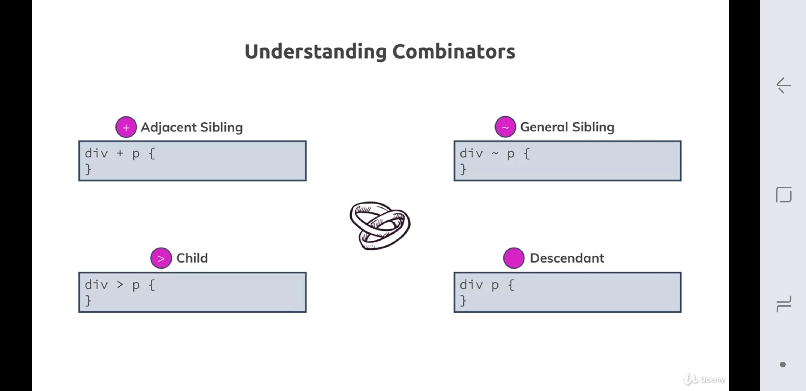
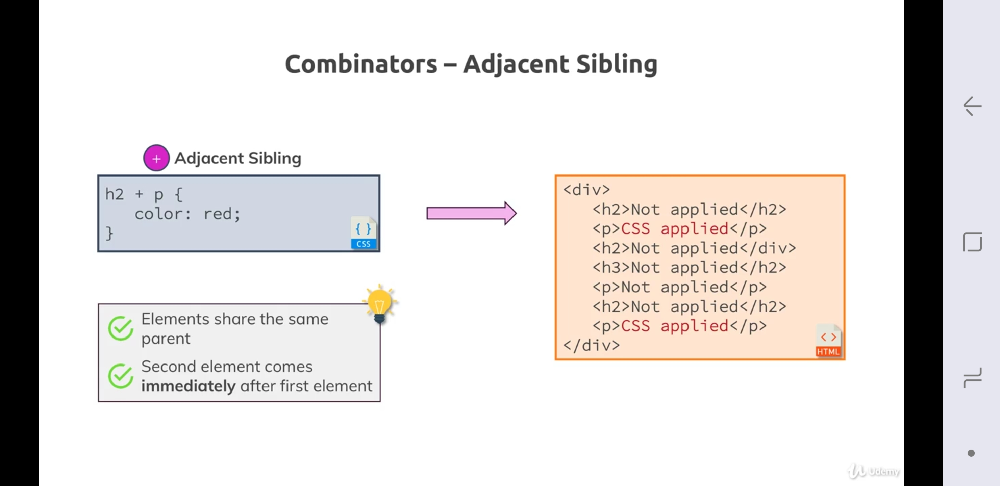
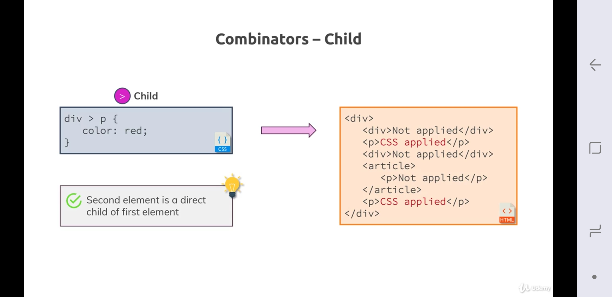
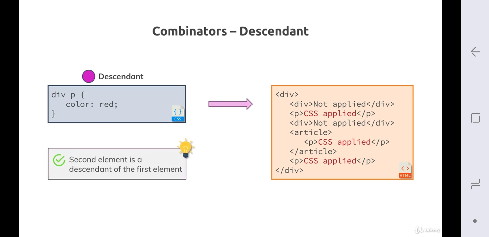

# CSS Selector

## Types:
1. **universal** --> * {} = `all tags`.
- set to all element, overrides browser default, overrides inheritance.
2. **element** --> h1 {} = `h1 tag only`
3. **classes** --> .s1{} = `<h1 class=s1>, <p class=s1>, etc`
- reusable.
4. **id** --> #s2{} = `<h1 id=s2>`
- can be used only once as id is unique in html.
5. **Attributes** --> [disabled] {} = <button disabled>, any other disable element.
6. **Combinator** --> multiple selector.
- eg : `#id1 h1 {}`

7. `a.active` vs `a .active`
- `a.active` --> it will select anchor with active class.
- `a .active` --> it will pick all desendant of achoe with class active.





***
## Grouping rule:
```
selector1,selector1 {
  //common declaration
}
```
***
## Specifity
1. scenario : 
```
<h1 class=s1> text </h1>

main.css:
   h1{ color : red } h1 { color : green}
// h1{ color : green} h1 { color : red } // change order
  .s1 { color : blue }

which color : ?
```
2. cascading mean multiple style can be applied on element which leads to conflict and resolve it provides **specifity**
3. preference/priority of selector


4. Inheritance : parent has lowest priority.
- eg : body is parent of h1
```
body{ color : black}

<body><h1 style="color:green"> </h1></body> 
```
5. _more specific will win._
- eg : 
```
#id1 h1 {} //1 win
h1 {} //2
```

6. `!important` --> override specifity and will always be applied. 
- eg : div{ color: red !important} --> color would always be red wahtever the order, inheritance ,etc.
- not preferred to use.

7. `<p c1 c2 > text </p>` --> priority for c1 and c2.
```
.c1{ color : red}
.c2{ color : blue} //win

here order matter 
```

***
## COMBINATOR





