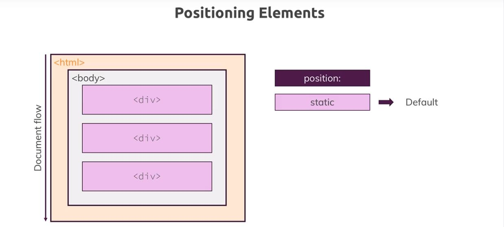
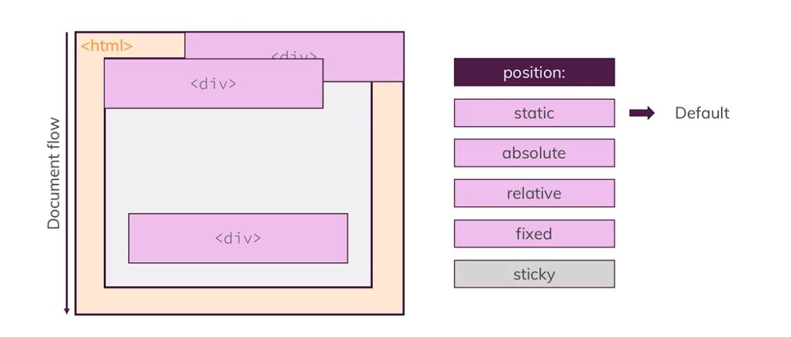
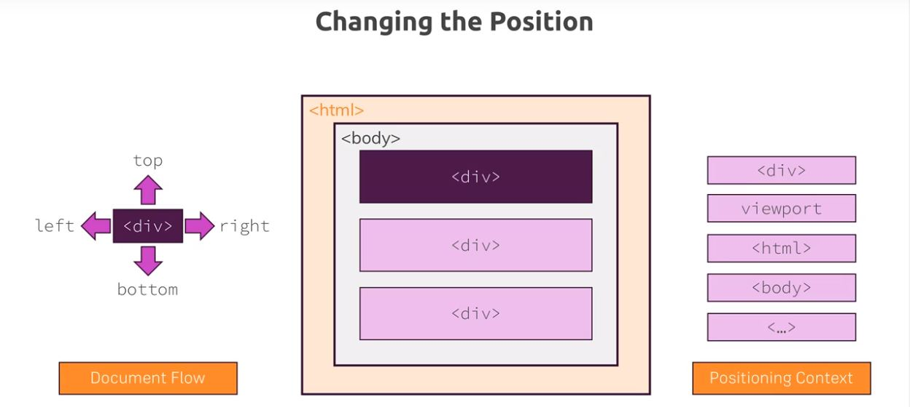
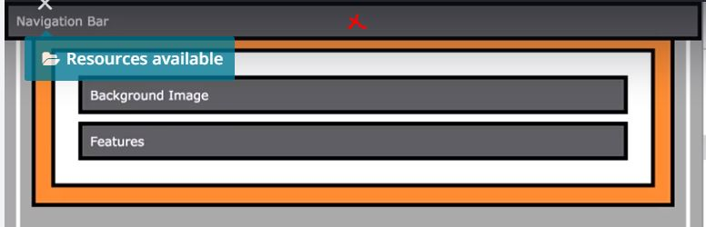
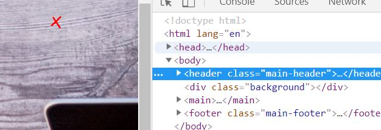
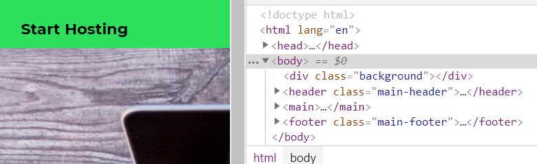
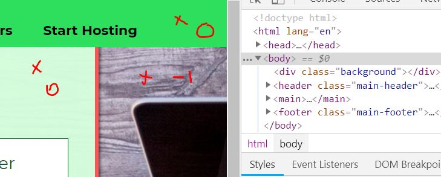
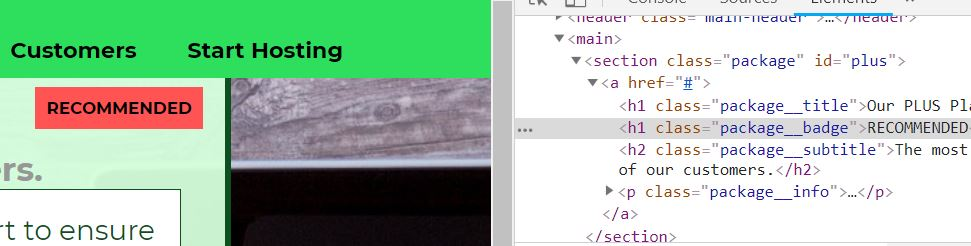
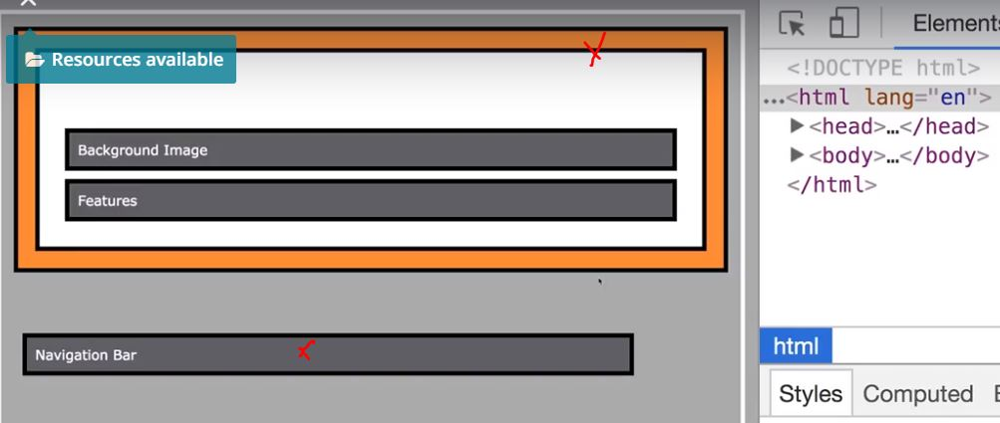
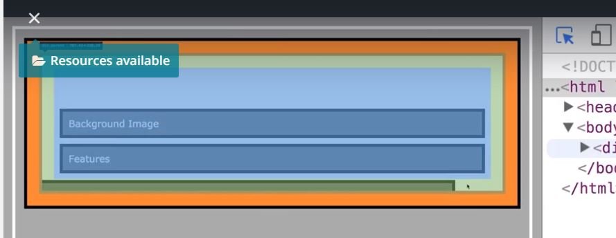

## Position
- `position` property does lot more, other than `display` property does (inline, block, inline-block)
- can change actual position of elemnt.
- Z-index : position elemt along z-axis.
- default values : `static`
- Other values : `fixed`, `absolute`, `relative`, `sticky` -- > by adding these valies we take element from normal document flow.
- can be applied to any element, no matter if its inline or block.
- **position Context** : 
- **stacking context** :

***

### Feature
1. Document flow > normal html > one elememt after anothor.
- default value of `position` is `static`. 


2. change default behaviour - use other value of `position` property.


3. Change the position, but how ? 


- `positioning context` : eg: [top : 30] --> 30px from current pos of elememt, or from view port, or from html tag, or from body, or from it parent, etc ? 
- if top,left,etc not been defined then value it does not mean its 0. element will take position as per flow. 
- z- index, top, left,etc would work only for non-static value.

***

### A. Fixed
- `positioning context` :  viewport.

eg: add fixed navbar and add background image

1.  create stable nav bar:
```
main-header { position:fixed, width:100%, box-sizing:border-boxing, margin : 10px ; top:0 ; left:0  }

// top:0, left:0  --> base is viewport.
```


2. Adding image in background behind the content.
```
.background {
    position: fixed; background: url("../images/plans-background.jpg");   
    width: 100%;    height: 100%;        
}
```
Image will come over document flow element because Z-index is not defined. default value is auto, equal to 0.

**case 1:** order of elememt : navBar div  > image div 
- image will lie on top of navbar ( _note : both are fixed position with z-index as auto_ )


**Case 2**: opposite order : image div > navBar div  
- navbar will lie on top of img  ( _note : both are fixed position with z-index as auto_ )


**Case 3**:
- Define navbar as static position in case2 eg, then img will come, _because: `fixed` will always come over `static`._ 

set z-index in above cases to change above default behaviour as per need.

Setting z-index to -1 to add image in bkgrnd:
```
.background {
    position: fixed;  background: url("../images/plans-background.jpg");    
    width: 100%;    height: 100%;       
    z-index: -1;
}
```


***

### B.Absolute 
`positioning context` :  
- **case 1:** if no parent/ansector is dedined with non-static position --> `html`
- **case 2:** if parent is marked as non-static position then `closest parent` would be position context.

eg: Adding badge

_note: COuld easy add badg in document flow. try to add it using non static position_

html:
```
<a class ="package"> //parent
    <h1 class="package__badge">RECOMMENDED</h1> //child
</a>
```
Css:
```
.package__badge{    position: absolute; margin: 10px; top:70px; left: 400px;}

.package { position:static } //case 1

```
position context is html


scroll up and see:


next change it 
```
.package { position : fixed/absolute/relative} //case 2
// note : relative wont break appl here.

.package__badge{
    position: absolute; margin: 16px; right: 0 ; top: 0;
    font-size: 12px; padding: 8px; background: #ff5454
// right: 0 ; top: 0 relative to parent .package
}

```

***

### C. Relative 
fixed/absolute positioned element gets out of document flow and get arranged relative to view port, html or closest ancestor/parent. next is relative positioned element.

`positioning context` : element itself.

- it does not take out element out of document flow.
- using top,left,ect can shift elemet out of its parent. (it must not be done.)


- `overflow : hidden`


Note : if adding `overflow : hidden` in `body` then also add it in `html`
***

### D. Sticky
hybrid : fixed and relative

***

#### stacking context
- 
