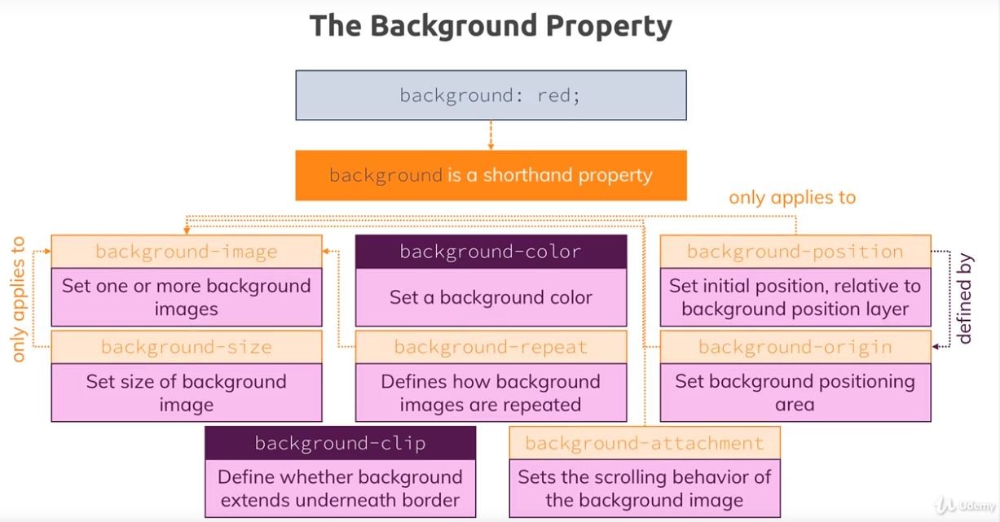
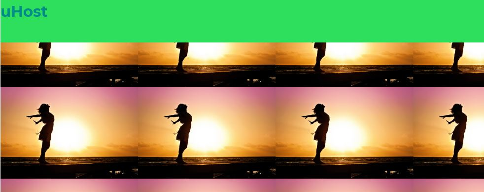
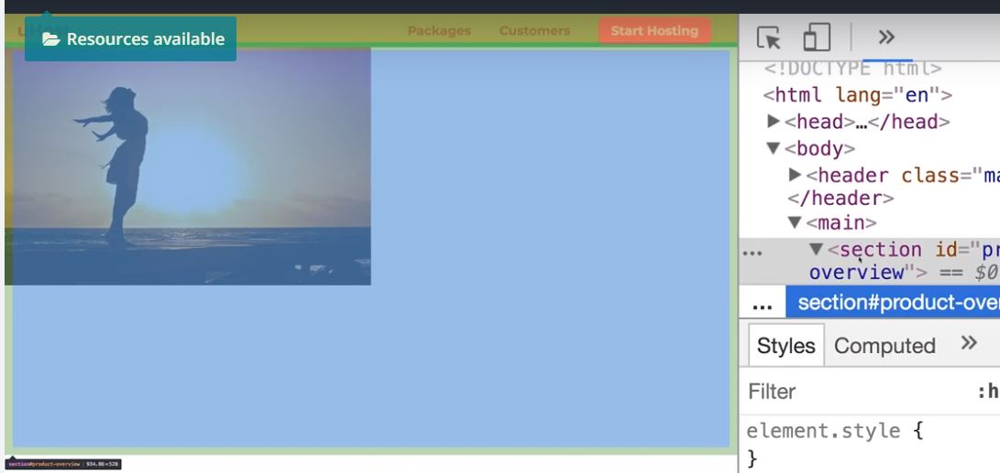
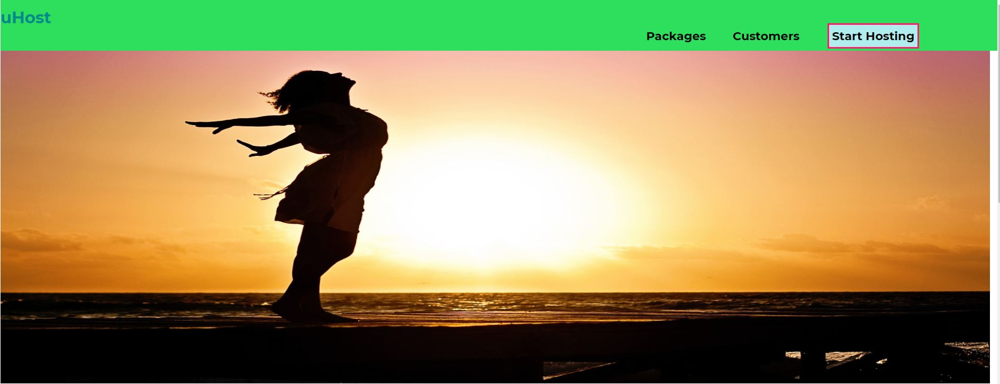

## Images and Background

### background property.
#### A. background-size
- shorthand : background: url("freedom.jpg"); 
```
background : url() left 20% top 30% / cover origin clip attachment

```
- Actual : background-image:  url("freedom.jpg"); 


**by PX**

1. `background-size: 200px;` 
- it will repeat image, `width` - 200px , `length` - as per aspect ratio.
- background-repeat: no-repeat/repeat-x/repeat-y
```
#product-overview {    
    background-image:  url("freedom.jpg");  background-size: 200px; 
    width:100%; height: 520px;
    background-repeat: no-repeat/repeat-x/repeat-y
}
```


2. `background-size: 300px 200px;` --> define both length and width --> this will distort img


**by %**

3 `background-size: 50%` --> width as 50% of container/parent.


4. `background-size: 50% 50%` --> both. this will distort img.

5. `background-size: 50% 100%`  --> Keep length 100% to fix it.

6. `background-size: auto 50%`  --> define length as 50% , width : as per aspect ratio

7. `background-size: 100%` --> width as 100% of container/parent amd height will be as per ratio, but it will cropped from bottom to main aspect ratio.

7.1. `background-size: 100% 100%` --> width and lenght as 100% of container/parent --> it wont get crop and fit image (distort)


**predifined setting : contain and cover**

8. `background-size: Contain` - it ensures full image is put in container.

9. `background-size : Cover` - it ensures full image is put in container + zoom in image if there is white space around + it also crops img if needed.

***

#### B. background-position

**by PX**

1. `background-position : 20px` (x-axis) --> shift from left

2. `background-position : 20px 30px` (x-axis, y-axis) --> shift from left  and from top.

**by %**

3.1 `background-position : 0% 20%` (x-axis, y-axis)  --> crop 20% from top. 


3.2 `background-position : 0% 50%` (x-axis, y-axis)  --> crop equally from top and bottom 


3.3 `background-position : 0% 100%` (x-axis, y-axis)  --> crop from top  and show complete bottom.


**left right top bottom**

4. `background-position : left top ` --> show left and top, crop rest accordingly.
5. `background-position : right bottom` --> show ...

**mix**

5. `background-position : left 20% top 30%`  --> show left and top, crop rest accordingly. crop 30% from top. crop 20% from left.
***

L-99

### C. background-origin
***
conceptually its like box-sizing. (for image)

Property values: 
1. content-box(default), 
2. border-box, 
3. padding box.

`Note` : add dashed `red 20px border`  around image container and inspect the above values then.

### D. background-clip
***

### E. background-attachment


