## Images and Background - part 2

### A. Add Logo - to understand below concept.

```
<a class="container">
     //200*200px img
</a>

.container{ h : 50px;  w : 50px ; display : inline-block}

.s1{ h : 100% ;  w : 100% } //100% of conatner which is 50px
```

1. container element for img is anchor (inline type) --> set container dimension to 50px 50px, but image is 200*200px, still full pixel image will shown

2. Make container `inline-block`, then image size will reduce to 50px.

***

### Adding customer images

```
image container style:

  .testimonial__image-container {
    width: 65%;
    display: inline-block;
    vertical-align: middle;
    box-shadow: 3px 3px 5px 3px rgba(0,0,0,0.3);
  }

image style:

  .testimonial__image {
    width: 100%;
    vertical-align: top;
  }
```
1. Adjust image width:
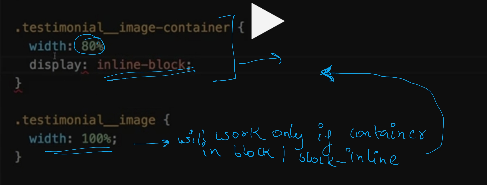 

2. image (80% width ) + info (20% width) , with proper verticle alignment.
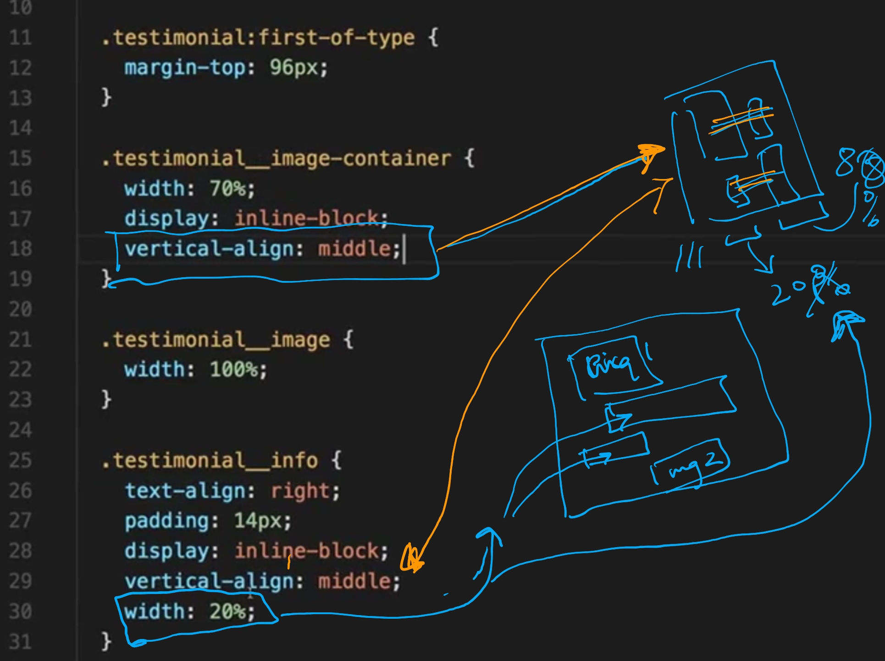 

3. Add shadow
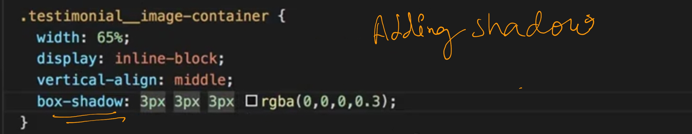 

final:
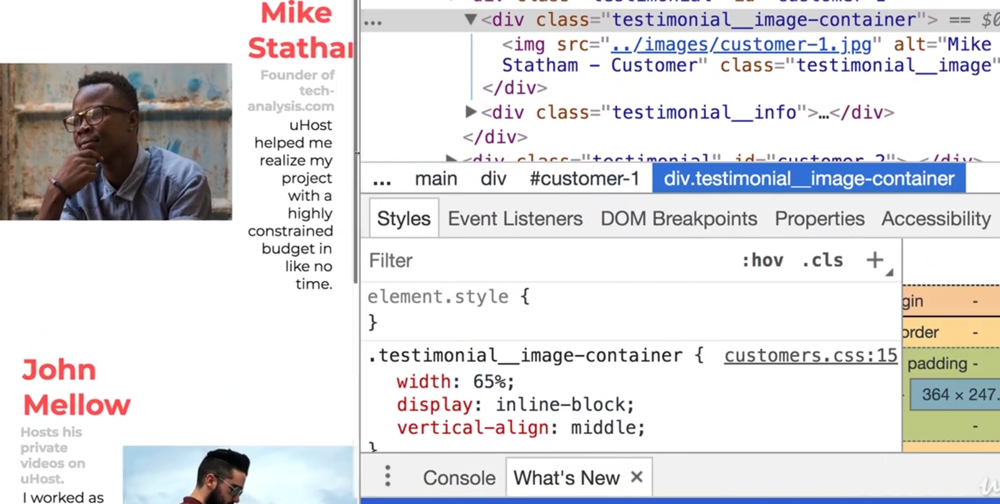 

*** 

### B. LINEAR GRADIENT
`background-color: linear-gradient()` //css functions

- `linear-gradient(red, blue, rgba()...)` // can use multiple colors in any of 3 format.

- `linear-gradient( 45deg, red, blue ...)` //rotate by angle.
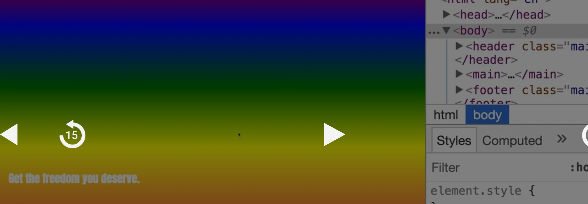 

- `linear-gradient( 180deg, red, transparent)`
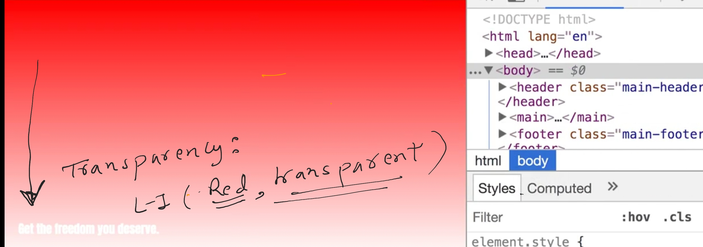 

- `linear-gradient( 180deg, red, 70%, blue, 30% )`
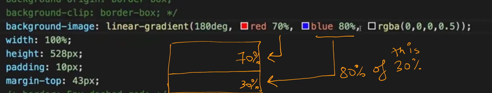 
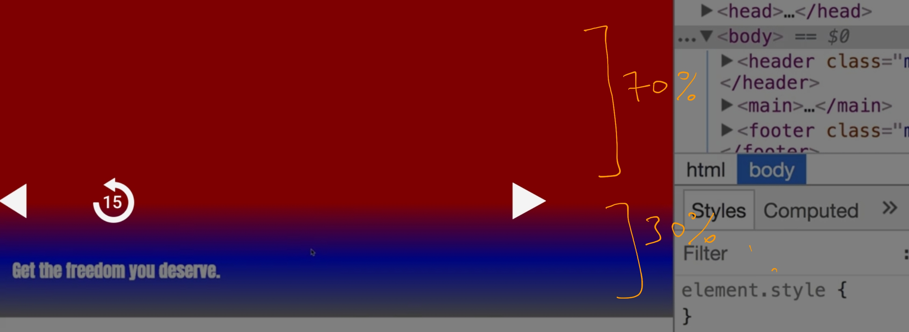 

***

### C. RADIAL GRADIENT

`background-color: radial-gradient()` //css functions

- radial-gradient(red, blue, rgba()...) // default shape is  eclipse.
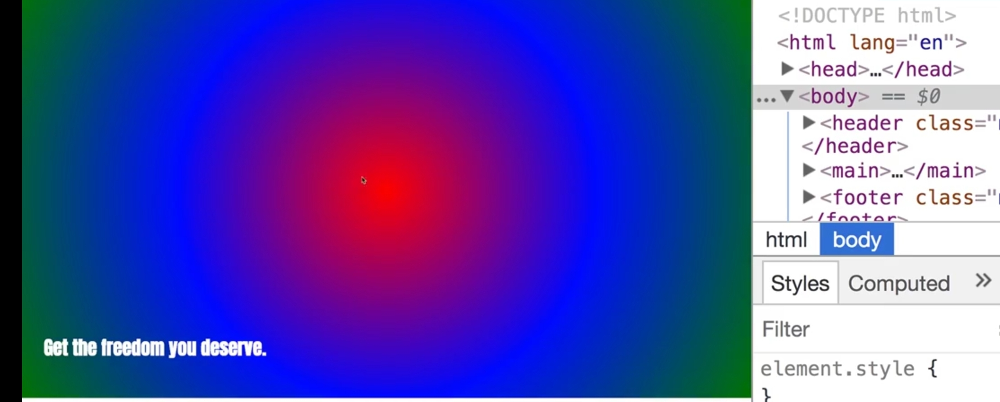 

- radial-gradient(circle, red, blue, geen...)

- radial-gradient(circle at top, red, blue, geen...)
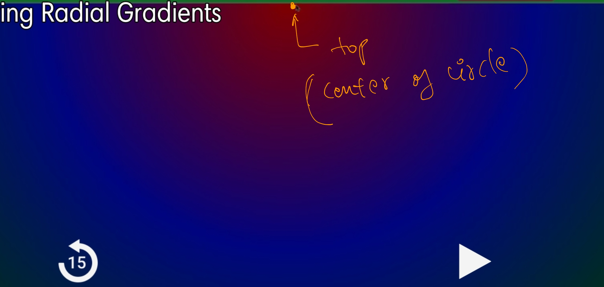 

- radial-gradient(circle at left top, red, blue, geen...)

- radial-gradient(circle at 20% 50%, red, blue, geen...)
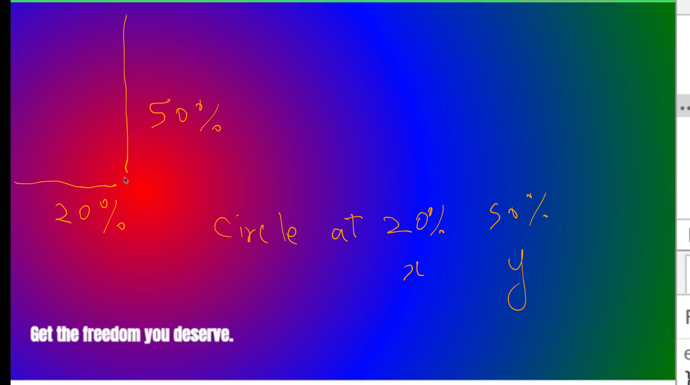 

- radial-gradient(circle 20px at top, red, blue, geen...) // size for cirlce is 20px
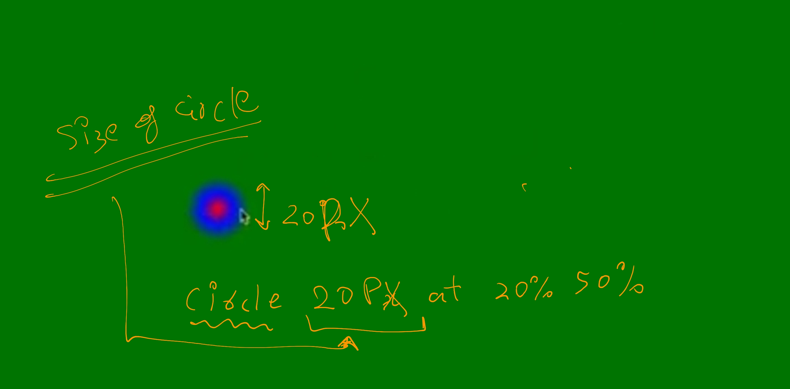 

- radial-gradient(eclipse 20px 30px at top, red, blue, geen...) // size for eclipse is 20px
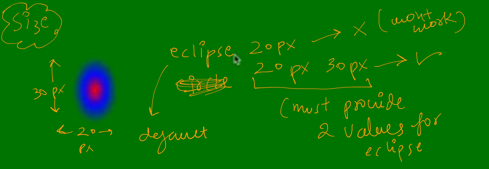 

***
