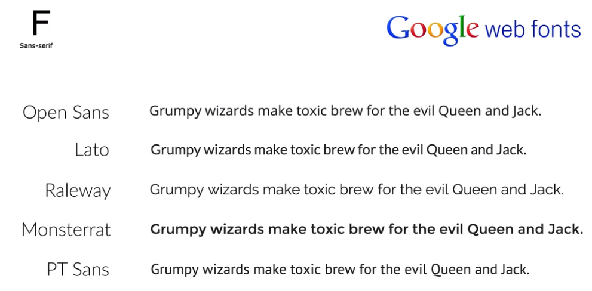
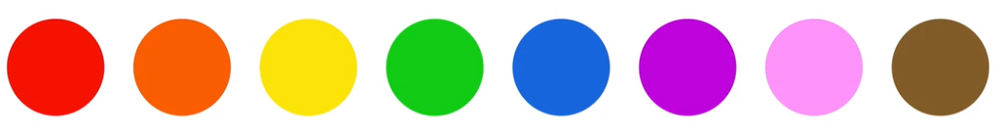
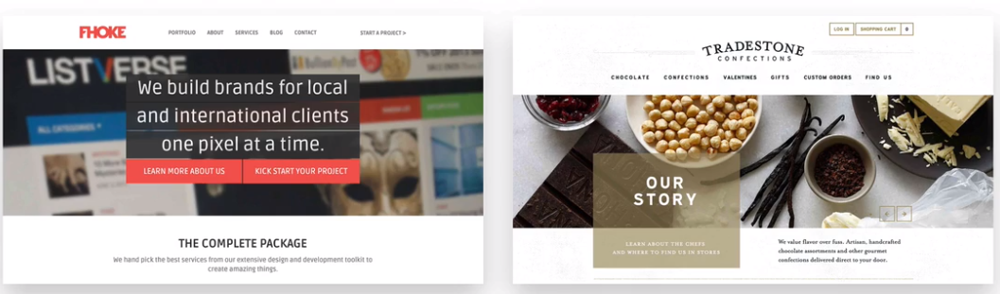
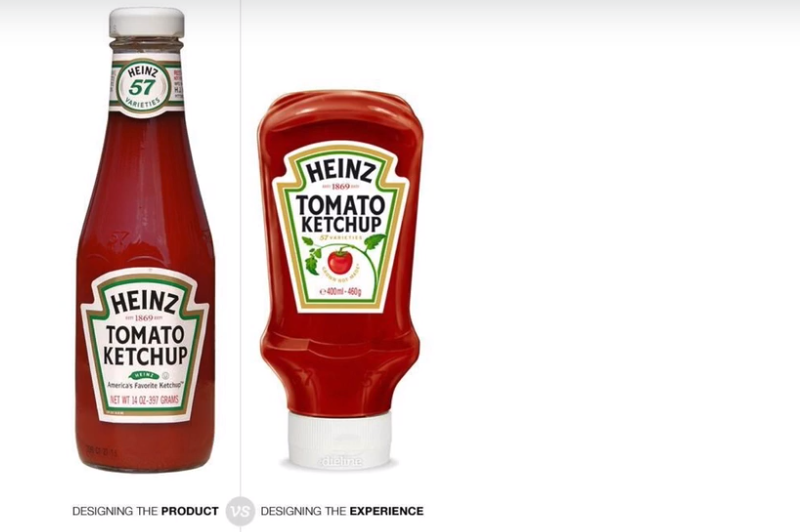

## Web Design Basic.

### key point:
1. Flat design - simple 2d design, used these days to have clear description and good user experience. eg: ios6 vs ios7.
2. 

***
### 1. Typography
1. most of your website will be text content.And so it's quite important to make that content good-looking and easy to read for the user.
2. choose the right font. (san-serif, sarif.)
3. Good practice (Guildlines):
- heading - 60px to 90px
- Body text - 15px to 25px
- line spacing - 150%
- char lenght per line - 45 to 90 char

### 2. color
1. Pick one base color for entire website.
2. Never use Black.

3. _**Red**_ is a great color to use when power, passion,strength and excitement want to be transmitted
4. _**Orange**_ draws attention without being as overpowering as red.
5. _**Yellow**_ is energetic and gives the feeling of happiness and liveliness.Also it associates with curiosity, intelligence.
6. _**Green**_ is the color of harmony, nature, life and health. Also it is often associated with money.
7. _**Blue**_ means patience, peace, trustworthiness and stability. It is associated with professionalism, trust and honor.

### 3. Images
1. Overlay the image with color and use text on top of it.

2. put text in box while displaying it over image.

3. blur the image.
4. Floor Fade -> Image fades to dark near text(text is brighter).

### 4. Icons
1. creates confusion to user if been used properly. hence necessary to under to use correct icons.
2. use it for action and links
3. use it list features/steps.
4. label icons
5. use  icon fonts - so that icon will get blured in high resolution devices.

### 5. spacing
1. use whitespacing to define visual hirarchy perfectly.

### 6. Presentation 

Type:
1. presentation of product in site
2. presentation of User **experience** - its not linked with design and look of product, but how used interacts. input.

