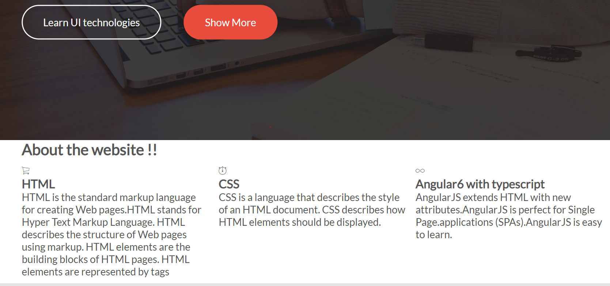
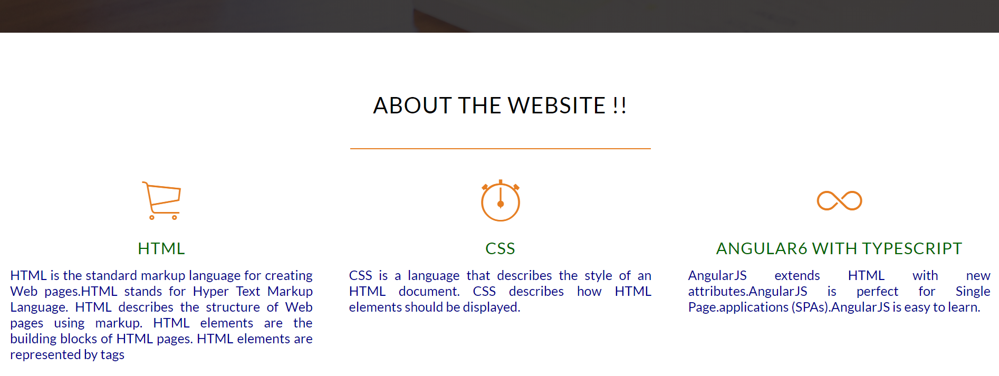

#### 1. Add Section
1. Added section to describe about site
2. Add `<link rel="stylesheet" type="text/css" href="vendors/css/ionicons.min.css">`
```
style:

section {
    padding: 80px 0;
}

.box {
    padding: 1%;
    text-align: justify;
}

.box p {
    font-size: 90%;
    color: darkblue;
}

template: 

<section>
        <div class="row">
            <h2> About the website !! </h2>
        </div>
        
            <div class="row">
                <div class="col span-1-of-3 box">
                    <i class="ion-ios-cart-outline icon-big"></i>
                    <h3>HTML</h3>
                <p>  About HTML - complet description. </p>
                </div>
                
               ...
               
               ...
               
            </div>
        </section>
```
outPut:


3. h2 and h3 style:

```
h1,h2,h3 {
    font-weight: 100;  /* 6.2 thickness */
    text-transform: uppercase;
    letter-spacing: 1px;   
}

h2 {
    margin: 0; 
    color: #000 ; font-size: 150% ; 
    text-align: center; 
}

h2:after{
    display: block;
    align: center;
    height: 2px;
    background-color: #e67e22;
    content: " ";
    width: 30%;
    margin: 0 auto;
    margin-top: 3%;
}

h3 {
    margin: 0; 
    color: darkgreen ; font-size: 110% ;
    text-align: center; 
    margin-bottom: 3%;
}
```

4. Icon:
```
Style:

.icon-big {
    font-size: 350%;
    display: block;
    color: #e67e22;
    margin-bottom: 10px;
    text-align: center;
}

template:
 <i class="ion-ios-infinite-outline icon-big"></i>
 
<link rel="stylesheet" type="text/css" href="vendors/css/ionicons.min.css">

```

outPut:

