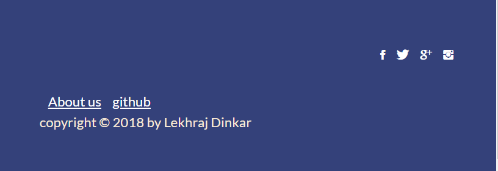

### Footer

1. tempalete:
```
 <footer>
            <div class="row">
                <div class="col span-1-of-2">
                    <ul class="footer-nav">
                        <li><a href="#">About us</a></li>
                        <li><a href="#">Blog</a></li>
                        <li><a href="#">Press</a></li>
                        <li><a href="#">iOS App</a></li>
                        <li><a href="#">Android App</a></li>
                    </ul>
                </div>
                <div class="col span-1-of-2">
                    <ul class="social-links">
                        <li><a href="#"><i class="ion-social-facebook"></i></a></li>
                        <li><a href="#"><i class="ion-social-twitter"></i></a></li>
                        <li><a href="#"><i class="ion-social-googleplus"></i></a></li>
                        <li><a href="#"><i class="ion-social-instagram"></i></a></li>
                    </ul>
                </div>
            </div>
            <div class="row">
                <p>
                    This webpage was created for the course "Design and Develop a Killer Website Using HTML5 and CSS3" by Jonas Schmedtmann. No copyrights here.<br>
                    This webpage is for you! So go and do whatever you want with it and have fun.
                </p>
                <p>
                    Build with <i class="ion-ios-heart" style="color: #ea0000; padding: 0 3px;"></i> in the beautiful city of Lisbon, Portugal, March 2015.
                </p>
            </div>
        </footer>
```
2. style: 
footer-nav(left) + social-links(right)
copyright

```
/* ----- Footers ----- */
footer {
    background-color: rgba(39, 53, 114, 0.94);
    padding: 50px;
    font-size: 80%;
    color: antiquewhite;
}

.footer-nav {    
    list-style: none;
    float: left;
    margin-top: 55px;
    margin-right: 5%;
}

.social-links {
    list-style: none;
    float: right;
}

.footer-nav li , .social-links li {
    display: inline-block;  /**/
    margin-left: 10px;
}

.footer-nav li a:link, .footer-nav li a:visited,
.social-links li a:link, .social-links li a:visited
{
    color: #fff;
    font-size: 100%;
    border-bottom: 1px solid transparent;
}

.footer-nav li a:hover, .footer-nav li a:active ,
.social-links li a:hover, .social-links li a:active
{
    color: #e74c3c;
    border: 1px solid #fff; 
    border-bottom: 1px solid #63ebac;
    padding: 8px;
    transition: border-bottom 1.0s;
}

.social-links li a:hover, .social-links li a:active
{
    font-size: 200%;
}


```

3. outPut:
